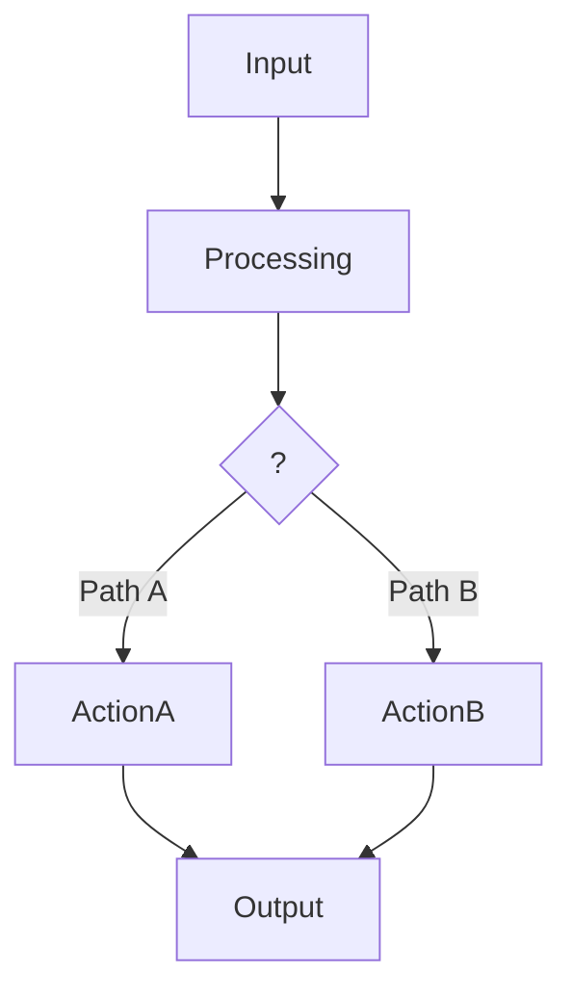
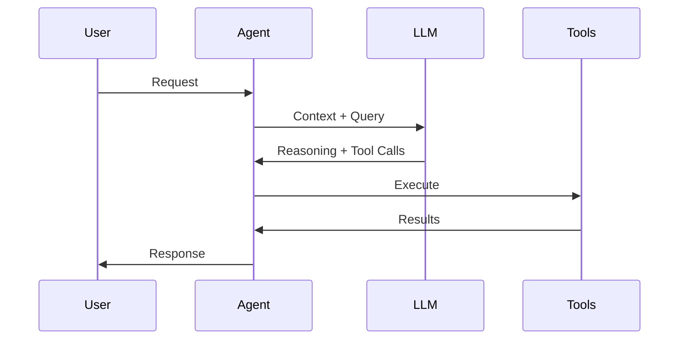
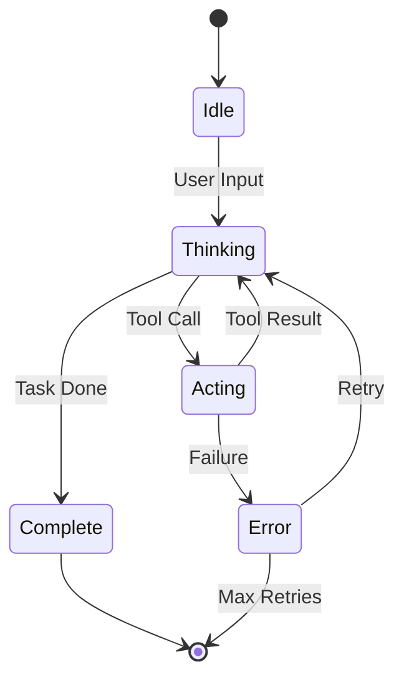
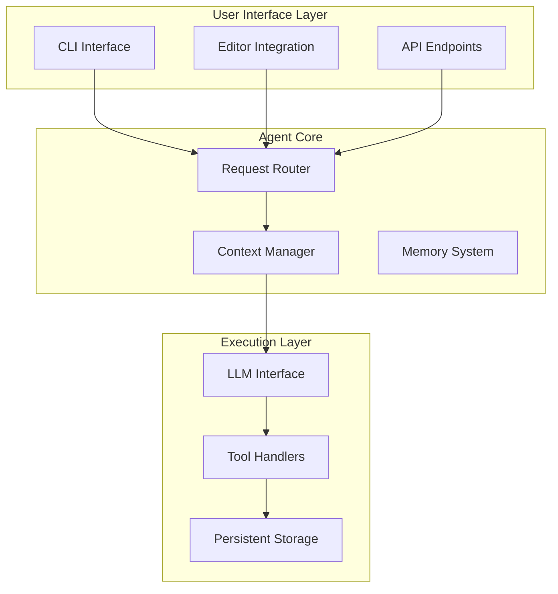
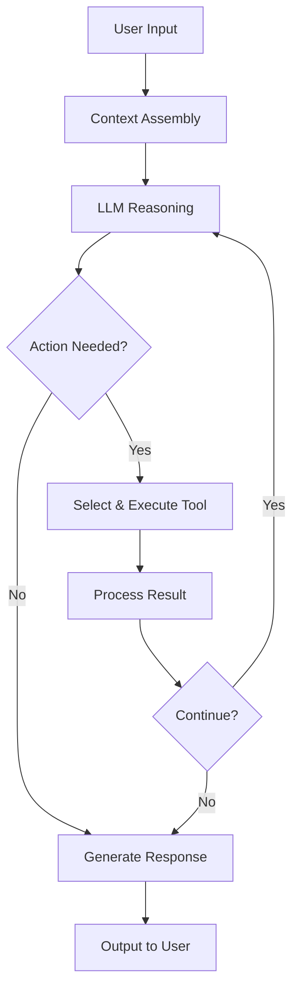
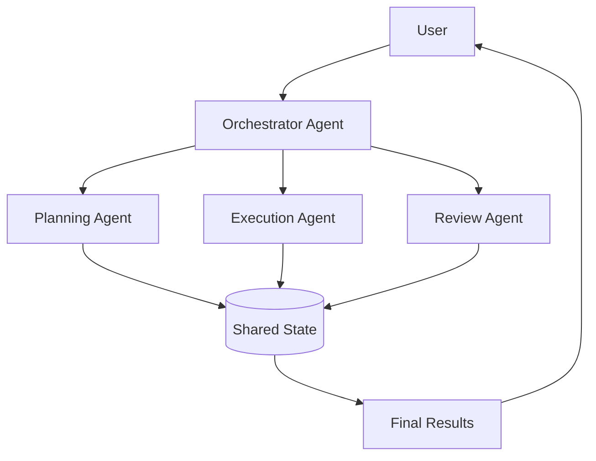
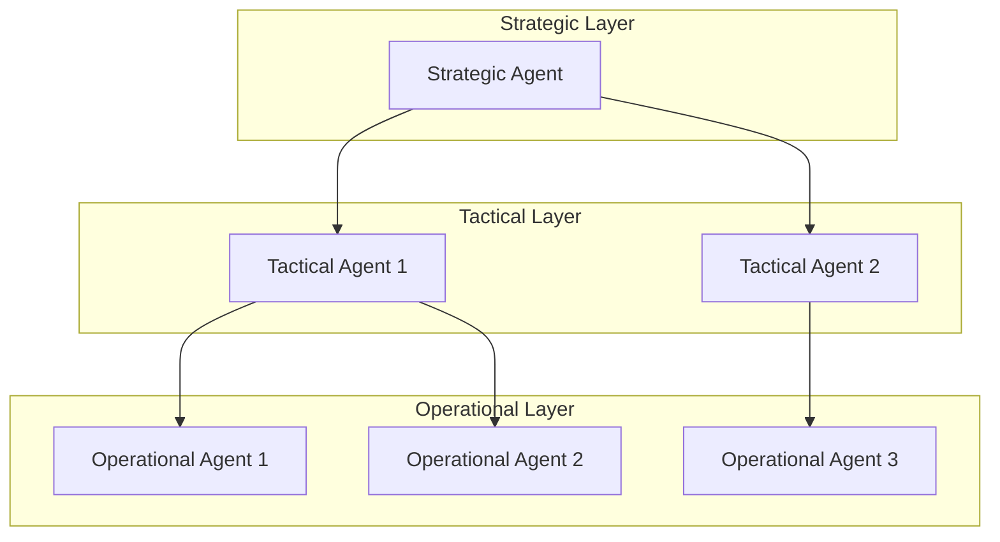
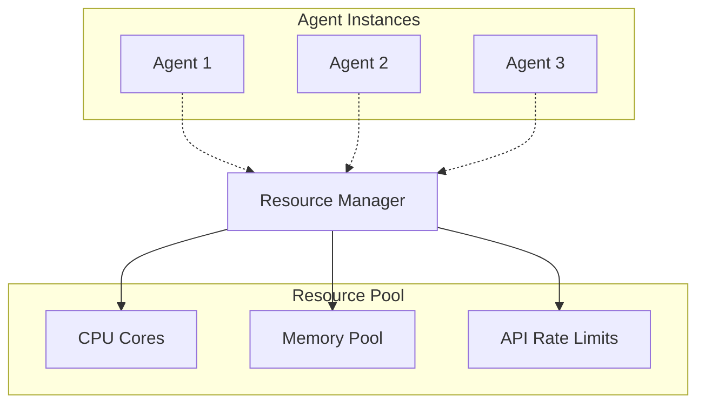
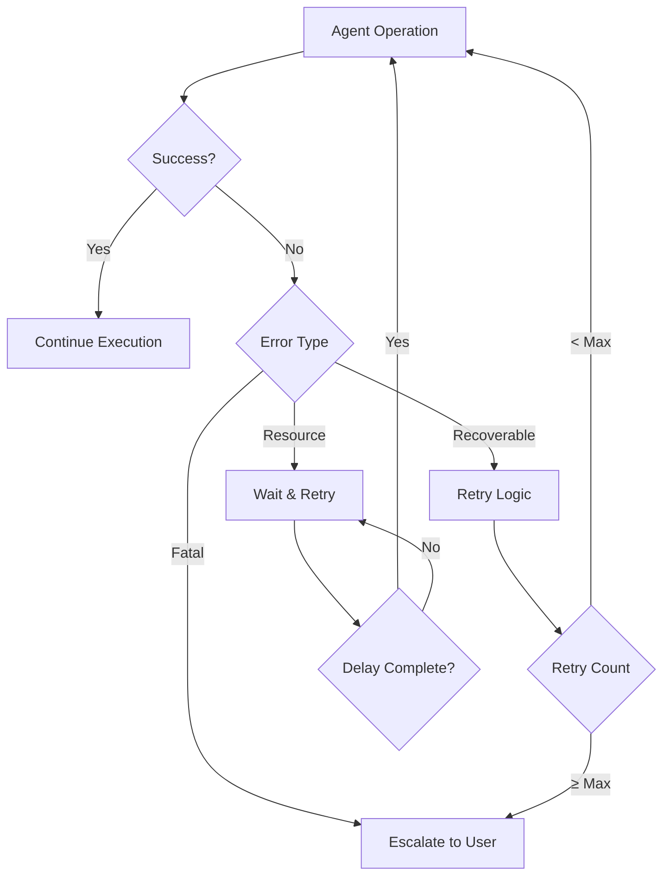

# Complete Guide to Diagramming Agentic Systems

## 1. Essential Diagram Types for Agentic Systems

### A. System Flow Diagrams
**Purpose**: Show the complete end-to-end process flow
**Best for**: Understanding overall system behavior and decision points

**Key Elements to Include**:
- User input entry points
- Context assembly/preprocessing
- Decision nodes (reasoning points)
- Tool/action execution
- Feedback loops
- Output generation
- Error handling paths

### B. Sequence Diagrams  
**Purpose**: Show time-ordered interactions between system components
**Best for**: Understanding component communication and data flow

**Key Elements to Include**:
- All system actors/components
- Message passing with data types
- Synchronous vs asynchronous calls
- Retry mechanisms
- Error responses

### C. State Diagrams
**Purpose**: Show system states and transitions
**Best for**: Understanding agent lifecycle and state management

### D. Component Architecture Diagrams
**Purpose**: Show system structure and dependencies
**Best for**: Understanding modular design and integration points

## 2. Specific Patterns for Different Agentic Architectures

### Single-Agent Systems (like Mini-Agent)

#### Core Components to Diagram:
1. **Input Processing Pipeline**
   - Context window management
   - Memory loading/saving
   - Token counting/summarization

2. **Reasoning Loop**
   - Interleaved thinking process
   - Decision trees
   - Tool selection logic

3. **Tool Execution Framework**
   - Tool routing mechanisms
   - Execution isolation
   - Result handling

4. **Feedback Integration**
   - Result processing
   - Context updating
   - Loop continuation logic

#### Sample Template:

### Multi-Agent Systems

#### Core Components to Diagram:
1. **Agent Orchestration**
   - Coordinator/supervisor patterns
   - Agent selection logic
   - Task distribution

2. **Inter-Agent Communication**
   - Message passing protocols
   - Shared memory/state
   - Conflict resolution

3. **Specialized Agent Roles**
   - Skill-specific agents
   - Domain expertise mapping
   - Capability matrices

#### Sample Template:

### Hierarchical Agent Systems

#### Core Components to Diagram:
1. **Hierarchy Levels**
   - Strategic/tactical/operational layers
   - Authority and delegation flows
   - Decision escalation paths

2. **Task Decomposition**
   - Problem breakdown logic
   - Subtask assignment
   - Result aggregation

#### Sample Template:

## 3. Diagramming Best Practices

### Visual Design Principles

1. **Color Coding System**:
   - 🔵 Blue: Input/Output operations
   - 🟡 Yellow: Decision points
   - 🟢 Green: Successful operations
   - 🔴 Red: Error/failure states
   - 🟠 Orange: Warning/retry states
   - 🟣 Purple: External systems/APIs

2. **Shape Conventions**:
   - Rectangles: Processes/operations
   - Diamonds: Decision points
   - Ovals: Start/end states
   - Cylinders: Data storage
   - Clouds: External services

3. **Layout Strategies**:
   - **Top-to-bottom**: For sequential processes
   - **Left-to-right**: For pipeline/workflow systems
   - **Circular**: For continuous loops
   - **Layered**: For hierarchical systems

### Information Architecture

#### Level 1: High-Level Overview
- System boundaries
- Major components
- Primary data flows
- Key decision points

#### Level 2: Component Detail
- Internal component structure
- Inter-component interfaces
- State management
- Error handling

#### Level 3: Implementation Detail
- Specific algorithms
- Data structures
- API contracts
- Performance considerations

### Documentation Integration

1. **Diagram Annotations**:
   - Component responsibilities
   - Data type specifications
   - Performance characteristics
   - Security considerations

2. **Cross-References**:
   - Code location references
   - Configuration parameters
   - External dependencies
   - Related documentation

## 4. Tools and Technologies

### Recommended Diagramming Tools

1. **Mermaid** (Text-based, version controllable)
   - Excellent for technical documentation
   - Integrates with markdown
   - Good for automated generation

2. **Draw.io/Diagrams.net** (Visual editor)
   - Rich feature set
   - Good for complex diagrams
   - Export to multiple formats

3. **PlantUML** (Text-based, advanced features)
   - Strong sequence diagram support
   - Good for complex state machines
   - Programmable diagram generation

4. **Lucidchart** (Professional collaborative)
   - Team collaboration features
   - Rich template library
   - Good for presentation-quality diagrams

### Code Integration Strategies

1. **Living Documentation**:
   - Generate diagrams from code annotations
   - Automated updates with CI/CD
   - Version control integration

2. **Architecture Decision Records (ADRs)**:
   - Link diagrams to architectural decisions
   - Maintain historical context
   - Decision rationale documentation

## 5. Advanced Diagramming Patterns

### Temporal Aspects

```mermaid
gantt
    title Agent System Timeline
    dateFormat  X
    axisFormat %s
    
    section Initialization
    Load Config    :0, 2
    Start Services :2, 4
    
    section Execution  
    User Request   :4, 5
    Process Loop   :5, 15
    Generate Response :15, 17
    
    section Cleanup
    Save State     :17, 18
    Shutdown       :18, 20
```

### Resource Management

### Error Propagation

## 6. Domain-Specific Considerations

### Code Generation Agents
- Abstract Syntax Tree (AST) representations
- Code transformation pipelines
- Compilation/validation flows
- Version control integration

### Data Analysis Agents  
- Data pipeline flows
- Model training/inference cycles
- Feature engineering processes
- Results visualization paths

### Conversational Agents
- Dialog state management
- Context window handling
- Persona/role switching
- Memory consolidation

### Task Planning Agents
- Goal decomposition trees
- Resource allocation strategies
- Dependency management
- Progress tracking mechanisms

This comprehensive guide should help you create detailed, professional diagrams for any agentic system architecture. Remember to start with high-level overviews and progressively add detail based on your audience's needs.