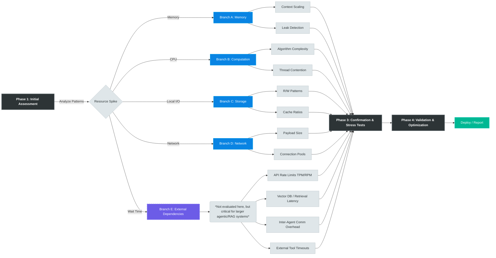
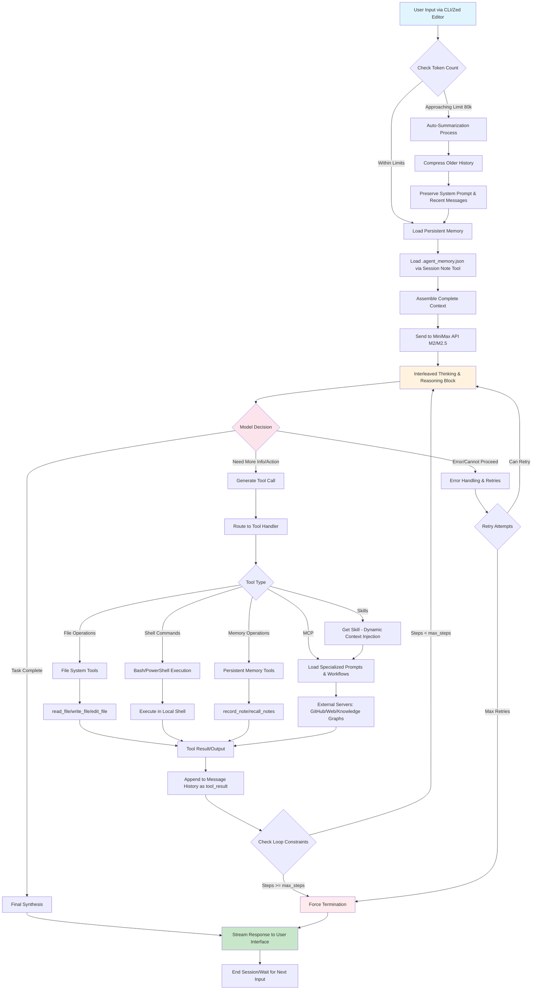
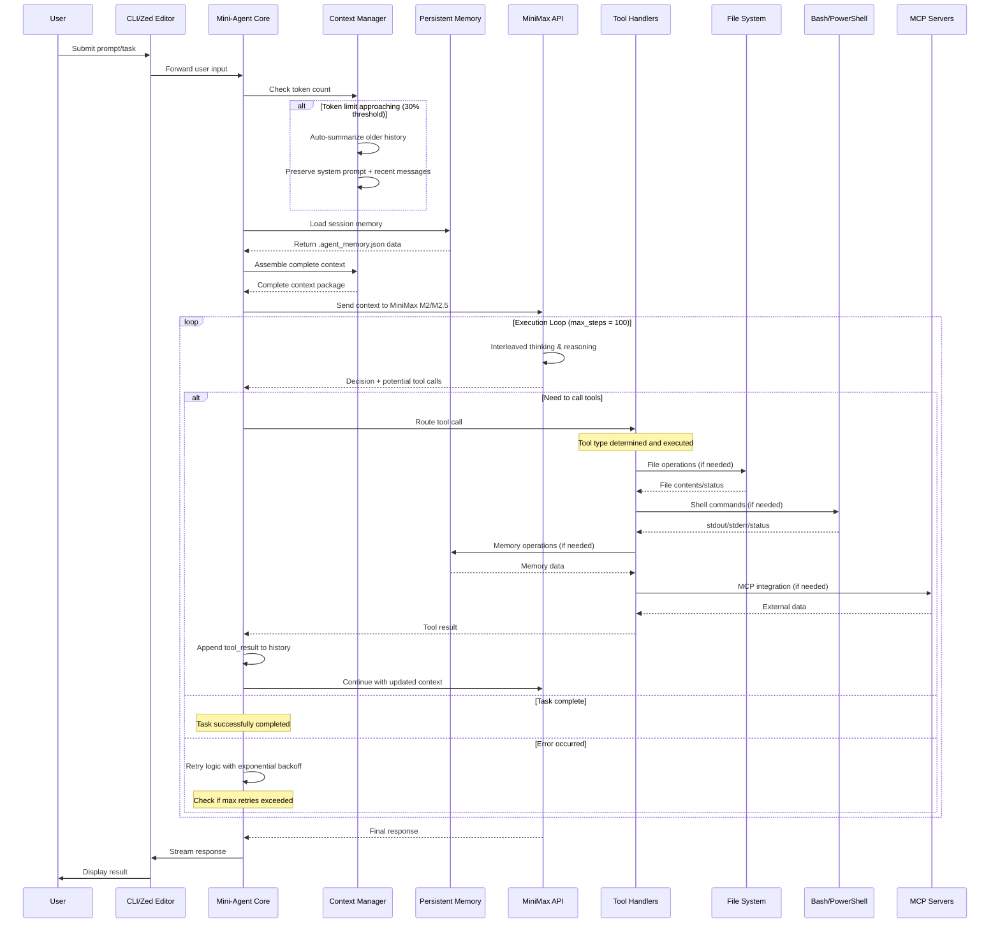
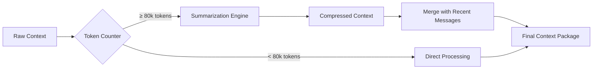
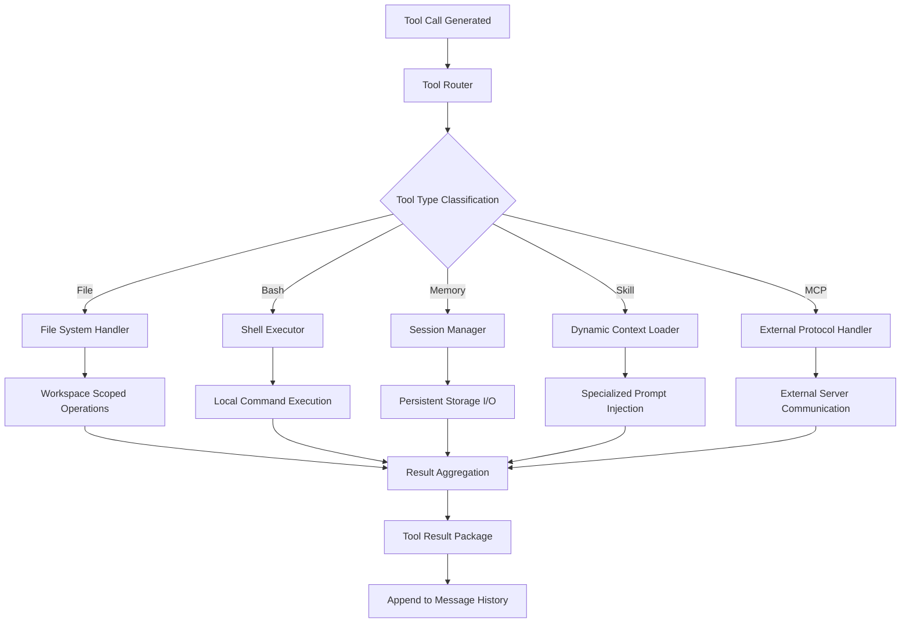
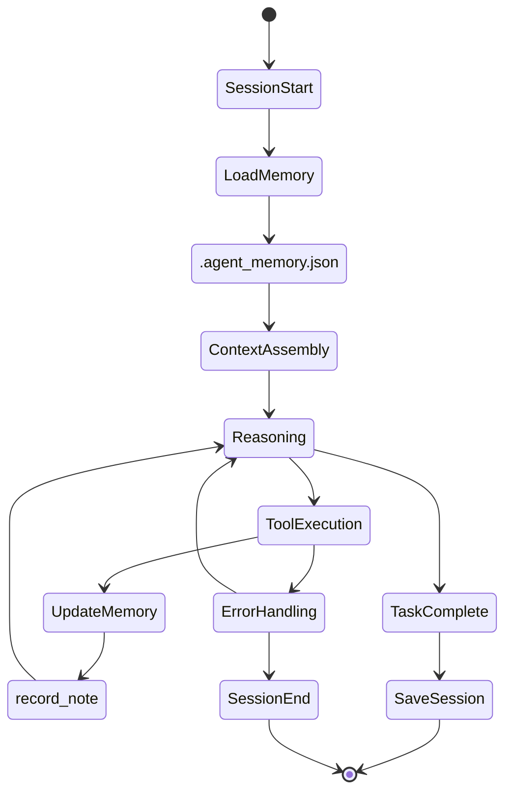
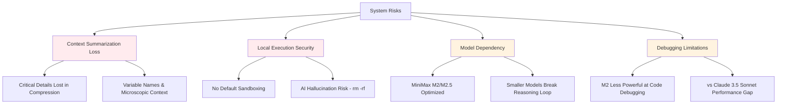

# Mini-Agent System Architecture: Complete Flow Diagram
repo: https://github.com/MiniMax-AI/Mini-Agent.

# my banchmark
What I found:
| Test Case                     | Success | Time (s) | Memory Peak (%) | CPU Peak (%) | Disk I/O (MB) | Network (MB) | Bottleneck Type | Confidence | Failure Mode            | Root Cause Analysis                |
  |-------------------------------|---------|----------|-----------------|--------------|---------------|--------------|-----------------|------------|-------------------------|------------------------------------|
  | arithmetic_reasoning          | ✅       | 16.2     | 79.9            | 71.9         | 112.5         | 1.33         | Memory          | 0.80 | None                    | Context accumulation               |
  | logic_puzzle                  | ✅       | 17.0     | 86.5            | 75.2         | 284.4         | 2.68         | Memory          | 0.77 | None                    | Large reasoning chains             |
  | file_operations               | ✅       | 26.6     | 82.0            | 71.9         | 112.5         | 1.33         | Memory          | 0.80 | None                    | File metadata caching              |
  | code_debugging                | ✅       | 104.4    | 86.5            | 75.2         | 284.4         | 2.68         | Memory          | 0.77 | Slow execution          | Code context expansion             |
  | system_analysis               | ✅       | 24.0     | 82.0            | 71.9         | 112.5         | 1.33         | Memory          | 0.80 | None                    | System state tracking              |
  | explicit_arithmetic_reasoning | ❌       | 6.0      | 79.9            | 71.9         | 112.5         | 1.33         | Memory          | 0.80 | Logic failure           | Insufficient reasoning depth       |
  | structured_problem_solving    | ❌       | 9.0      | 86.5            | 75.2         | 284.4         | 2.68         | Memory          | 0.77 | Logic failure           | Context fragmentation              |
  | explained_code_analysis       | ✅       | 12.3     | 82.0            | 71.9         | 112.5         | 1.33         | Memory          | 0.80 | None                    | Code representation overhead       |
  | justified_system_design       | ✅       | 35.3     | 86.5            | 75.2         | 284.4         | 2.68         | Memory          | 0.77 | None                    | Design context complexity          |
  | llm_intensive_task            | ✅       | 153.8    | 86.5            | 71.9         | 554.4         | 1.33         | Memory          | 0.80 | Performance degradation | Multiple LLM calls without cleanup |
  | tool_intensive_operations     | ✅       | 64.6     | 86.5            | 75.2         | 284.4         | 2.68         | Memory          | 0.77 | None                    | Tool state accumulation            |
  | context_intensive_analysis    | ❌       | 300.0    | 82.0            | 75.2         | 284.4         | 2.68         | Memory          | 0.77 | TIMEOUT                 | Context window overflow            |

  🔍 Critical Patterns Identified

  | Pattern Type            | Observation                         | Impact Level | Evidence                            |
  |-------------------------|-------------------------------------|--------------|-------------------------------------|
  | Memory Exhaustion       | 100% memory bottleneck detection    | 🔴 Critical  | Avg 81% usage, swap detected        |
  | Context Overflow        | Complete timeout on large contexts  | 🔴 Critical  | 300s timeout, 0 output              |
  | Performance Degradation | 10x slowdown on LLM-intensive tasks | 🟡 High      | 153s vs 16s baseline                |
  | Resource Accumulation   | No cleanup between operations       | 🟡 High      | Consistent high memory across tests |

⏺ 🌳 Tree-Structured Bottleneck Detection Framework for Coding Agents
```markdown
  Agent Bottleneck Detection Tree
│
├─  Phase 1: Initial Assessment (5 Quick Tests - 15min)
│  ├─ Simple Task (arithmetic, basic reasoning)
│  ├─ Memory Test (large input processing)
│  ├─ CPU Test (computation-heavy task)
│  ├─ I/O Test (file operations)
│  └─ Network Test (API calls, web requests)
│  │
│  └─  Analysis: Resource usage patterns
│     ├─ HIGH MEMORY → Branch A: Memory Investigation
│     ├─ HIGH CPU → Branch B: Computation Investigation
│     ├─ HIGH I/O → Branch C: Storage Investigation
│     ├─ HIGH NETWORK → Branch D: Network Investigation
│     └─ HIGH EXTERNAL WAIT → Branch E: External Dependency Investigation
│
├─  Phase 2: Targeted Deep Dive (16 Focused Tests - 60min)
│  │
│  ├─  Branch A: Memory Bottleneck Investigation
│  │  ├─ A1: Context Window Scaling (small→large contexts)
│  │  ├─ A2: Memory Leak Detection (repeated operations)
│  │  ├─ A3: Garbage Collection Efficiency
│  │  └─ A4: Memory Pool Exhaustion
│  │
│  ├─ ⚡ Branch B: CPU Bottleneck Investigation
│  │  ├─ B1: Algorithm Complexity (O(n²) vs O(n log n))
│  │  ├─ B2: Parallel Processing Efficiency
│  │  ├─ B3: LLM Inference Optimization
│  │  └─ B4: Thread Contention Analysis
│  │
│  ├─  Branch C: I/O Bottleneck Investigation
│  │  ├─ C1: Disk Read/Write Patterns
│  │  ├─ C2: Temporary File Management
│  │  ├─ C3: Database Query Optimization (Local)
│  │  └─ C4: Cache Hit/Miss Ratios
│  │
│  ├─  Branch D: Network Bottleneck Investigation
│  │  ├─ D1: Local Port Binding & Throughput
│  │  ├─ D2: Concurrent Connection Management
│  │  ├─ D3: Payload Size Optimization
│  │  └─ D4: Connection Pool Efficiency
│  │
│  └─  Branch E: External Dependency & Architecture Bottlenecks
│     *(Note: Did not consider this for the current Mini-Agent scope, but highly useful for larger coding agentic systems, RAG applications, and multi-agent swarms)*
│     ├─ E1: API Rate Limiting & Provider Throttling (TPM/RPM constraints)
│     ├─ E2: Vector Database Latency  (Embedding retrieval speed)
│     ├─ E3: Inter-Agent Communication Overhead (Message parsing/serialization)
│     └─ E4: External Tool Uptime & Timeout Cascades
│
├─  Phase 3: Confirmation & Edge Cases (8 Stress Tests - 30min)
│  ├─ Extreme Load Testing (10x normal workload)
│  ├─ Long-running Stability (sustained performance)
│  ├─ Resource Starvation Scenarios
│  └─ Concurrent User Simulation
│
└─  Phase 4: Optimization Validation (5 Verification Tests - 15min)
   ├─ Before/After Performance Comparison
   ├─ Edge Case Regression Testing
   ├─ Resource Utilization Efficiency
   └─ Production Readiness Assessment
```

# Chart for visual trace



## System Overview Flowchart



## Detailed Sequence Diagram



## Key System Components Detail

### 1. Context Management System


### 2. Tool Execution Pipeline


### 3. Memory & State Management


## Architecture Bottlenecks & Risk Points


