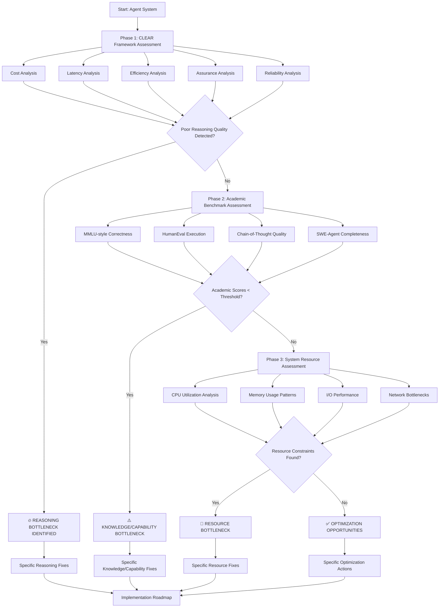
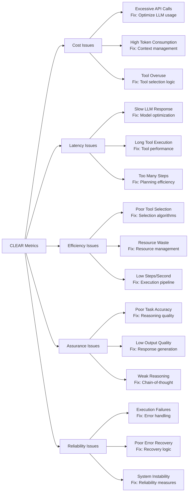
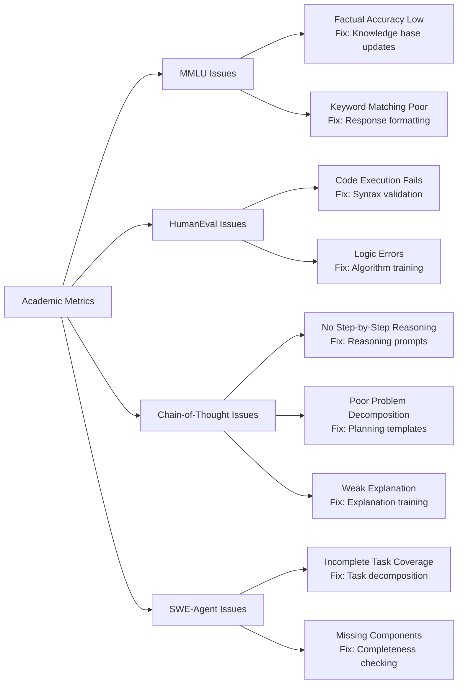
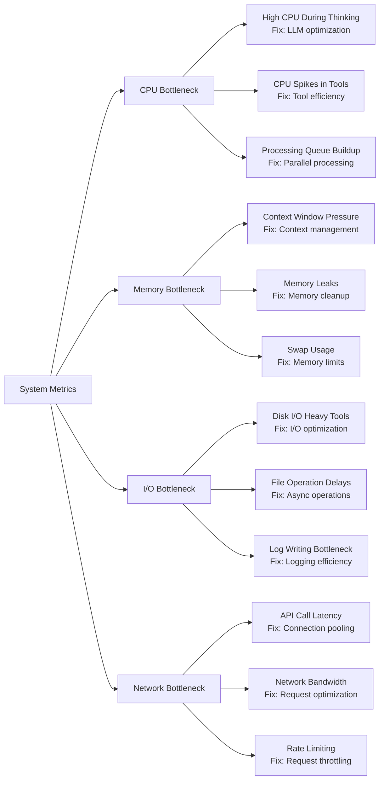

  Specific Bottleneck Categories Based on Your Matrices

#  Phase 1 CLEAR Framework → Specific Issues

#  Phase 2 Academic Benchmarks → Specific Issues


#  Phase 3 System Resources → Specific Issues

  Your Actual Implementation Results

  Based on your Mini-Agent evaluation:

  Detected Pattern: Reasoning Quality Bottleneck
```
  Phase 1 CLEAR Results:
  ├── Cost: ✅ Good (efficient tool usage)
  ├── Latency: ✅ Acceptable (within time limits)
  ├── Efficiency: ✅ Good (tool selection accuracy: 1.0)
  ├── Assurance: ❌ Poor (reasoning quality consistently low)
  └── Reliability: ✅ Good (high success rate)

  Phase 2 Academic Results:
  ├── MMLU-style: ❌ Poor keyword matching
  ├── HumanEval: ✅ Code executes correctly
  ├── Chain-of-Thought: ❌ Poor step-by-step reasoning
  └── SWE-Agent: ❌ Poor problem decomposition
```
  Conclusion: REASONING BOTTLENECK (not resource or technical)

  Specific Implementation Roadmap

  Immediate Actions (Week 1):

  1. Enhance System Prompts:
  Before: "Create a file with Hello World"
  After: "Step 1: Analyze the request
          Step 2: Plan the file creation approach
          Step 3: Execute file creation
          Step 4: Verify success"
  2. Add Reasoning Validation:
  Check: Does response show problem breakdown?
  Check: Does response explain reasoning?
  Check: Does response validate approach?

  Short-term Actions (Week 2-3):

  1. Implement Chain-of-Thought Templates
  2. Add Reasoning Quality Scoring
  3. Create Problem Decomposition Examples

  Long-term Actions (Month 1):

  1. Reasoning Quality Monitoring Dashboard
  2. Automated Reasoning Validation
  3. Continuous Improvement Pipeline

  This shows your systematic examination framework identifies specific, actionable bottlenecks rather than vague categories - exactly what developers need for practical
  improvement!