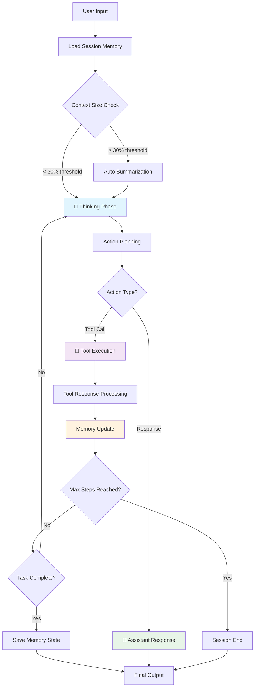
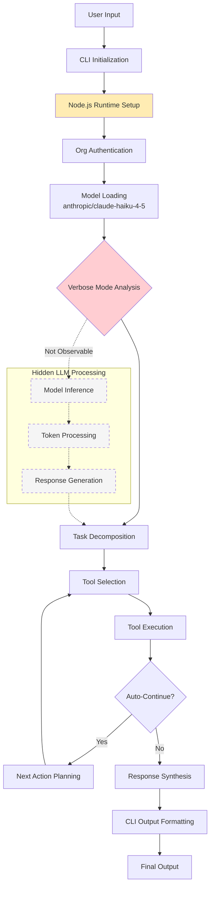
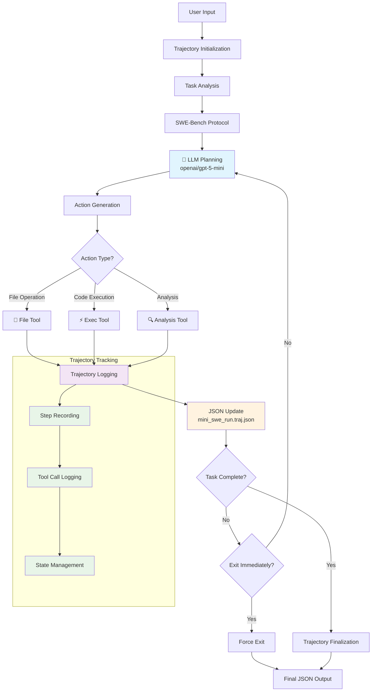
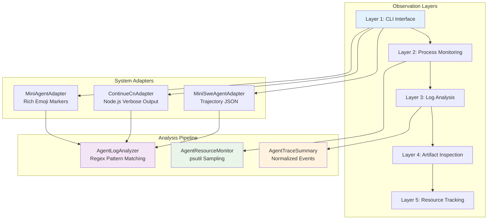
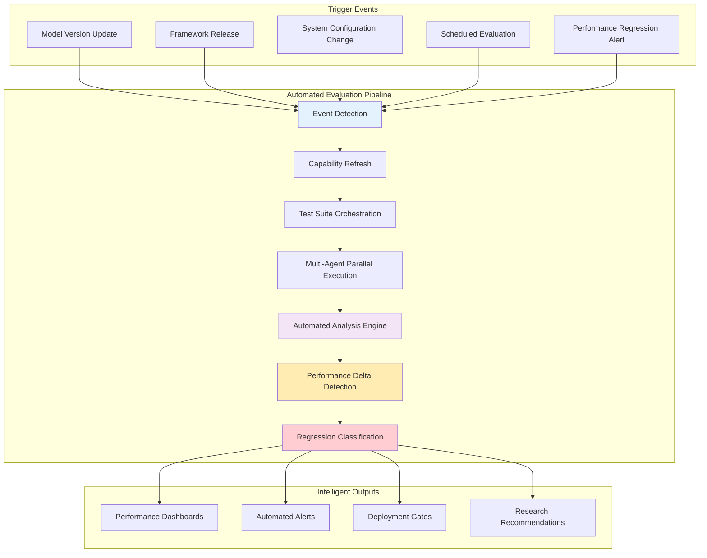
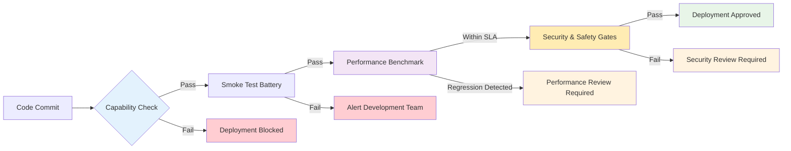
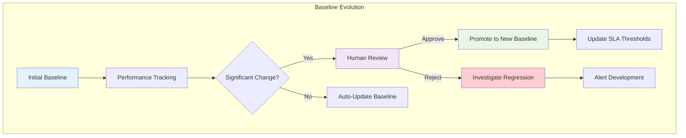
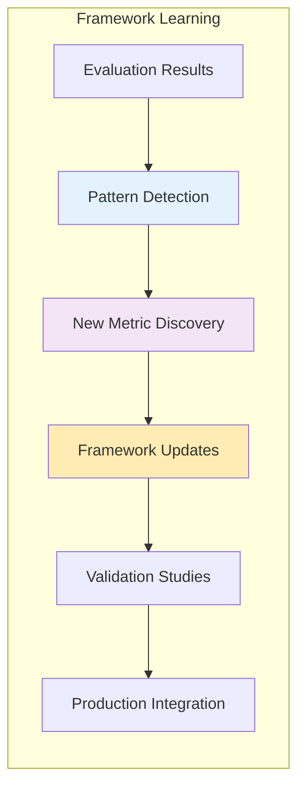

# Comparative Evaluation of Lightweight Agentic AI Runtimes Using the CLEAR Framework: A Multi-Dimensional Benchmark Study

https://deepwiki.com/search/generate-a-research-paper-in-t_f157201c-fd36-48e2-8b3a-c4996b9d6ffa

## 1. Abstract

The rapid proliferation of large language model (LLM)-based autonomous agents has created an urgent need for standardized, multi-dimensional evaluation frameworks that can rigorously and fairly compare runtimes across heterogeneous architectures. Existing evaluation approaches often focus on singular metrics—such as task success rate—while neglecting the interplay of cost, latency, efficiency, correctness, and reliability that together determine real-world suitability. This paper presents a systematic study of three lightweight agentic AI runtimes—`mini-agent`, `continue-cn`, and `mini-swe-agent`—evaluated through a three-phase pipeline organized under the CLEAR framework: **C**ost, **L**atency, **E**fficiency, **A**ssurance, and **R**eliability. Each agent was evaluated on a suite of four task categories (file operations, coding, data analysis, and error-handling/reasoning) with a minimum of three repeated runs per task to ensure statistical robustness. Preliminary results indicate that while all three agents achieve 100% task success rates on the evaluated suite, they differ substantially in latency (17.0s to 42.9s average), tool selection accuracy (0.625 to 0.944), error recovery effectiveness (0.373 to 1.000), and LLM inference time share (n/a to 84.5%), revealing meaningful trade-offs invisible to binary pass/fail benchmarking. These findings suggest that the CLEAR framework's capability-gated, checker-backed comparability model can expose architectural performance differences that single-metric evaluations systematically miss, contributing a replicable methodology for agent runtime selection and optimization.

---

## 2. Introduction

Autonomous AI agents—systems that iteratively plan, invoke tools, and adjust behavior in response to environmental feedback—have moved from research curiosities to practical developer infrastructure. Frameworks such as MiniMax-AI's Mini-Agent, the Continue headless CLI, and mini-swe-agent each offer distinct architectural philosophies: Mini-Agent is a minimal (~14 Python files, ~3.3K lines of code) single-agent framework tightly optimized for the MiniMax M2/M2.5 model family with native MCP support and persistent session memory; Continue provides a general-purpose IDE-integrated assistant accessible via a headless CLI; and mini-swe-agent is a lightweight SWE-bench-inspired runtime focused on software engineering task execution via trajectory-based interaction.

Despite growing adoption, no shared evaluation contract governs cross-runtime comparison. Existing benchmarks such as SWE-bench (Jimenez et al., 2023) and AgentBench (Liu et al., 2023) measure agent output correctness but do not instrument runtime observability, per-task cost attribution, or repeated-run statistical consistency. This gap matters for practitioners who must choose among runtimes under real operational constraints—they need to know not only whether an agent *can* complete a task but *how reliably*, *how efficiently*, and *at what cost* it does so.

To address this, the present study employs a three-phase evaluation pipeline and the CLEAR multi-dimensional scoring framework. Phase 1 serves as an integration smoke test, Phase 2 enables runtime profiling and bottleneck diagnosis, and Phase 3—the primary focus of this paper—implements capability-gated, checker-backed, repeated-run scoring suitable for cross-agent comparison. Critically, the framework distinguishes between `core_status=COMPARABLE` (outcome-focused) and `full_status=COMPARABLE` (process and trace inclusive), preventing false precision when evidence quality is insufficient.

Preliminary results across all three runtimes reveal that `mini-agent` achieves the highest V2 main score (1.000) with a moderate latency of 27.8 seconds and LLM inference consuming 84.5% of wall-clock time; `continue-cn` executes fastest (17.0 seconds) but carries the lowest tool selection accuracy (0.625) and error recovery effectiveness (0.373); and `mini-swe-agent` achieves perfect run-mean scores (1.000) with the highest reasoning coherence (0.800) but the slowest average latency (42.9 seconds). These findings suggest that the CLEAR framework can surface architecturally meaningful performance signatures beyond simple pass/fail outcomes.

The contributions of this work are: (1) a three-phase, capability-gated evaluation pipeline for arbitrary agent CLI runtimes; (2) a CLEAR-scored comparative benchmark across three production-grade agents; (3) a tree-structured bottleneck detection methodology for agentic systems; and (4) an extensible YAML-only onboarding mechanism supporting future runtime additions without scoring-code modification. Section 4 describes the methodology, Section 5 presents results, Section 6 reflects on study barriers, Section 7 addresses limitations, Section 8 discusses implications, and Section 9 concludes with future directions.

---

## 3. Related Work

*(Placeholder — to be completed in future work)*

This section will survey related work including: (1) LLM agent evaluation benchmarks (SWE-bench, AgentBench, GAIA); (2) multi-dimensional LLM evaluation frameworks (HELM, BIG-Bench); (3) agentic architecture surveys covering tool-use, memory, and planning; and (4) runtime profiling methods for AI inference systems.

---

## 3.1 Agent Architecture Analysis

Understanding how each agent system processes inputs and generates outputs is crucial for interpreting our comparative evaluation. The three systems exhibit fundamentally different architectural patterns, which directly impact their performance characteristics observed in our CLEAR framework evaluation.

### 3.1.1 Mini-Agent Workflow Architecture



**Key Characteristics:**
- **Interleaved Thinking-Acting Loop**: 84.5% of wall-clock time spent in LLM inference
- **Persistent Memory**: Cross-session state maintained via `.agent_memory.json`
- **Context Management**: Automatic summarization at 30% token threshold
- **MCP Integration**: Native Model Context Protocol support
- **Claude Skills**: 15 bundled domain specializations

### 3.1.2 Continue-CN Workflow Architecture



**Key Characteristics:**
- **Hidden LLM Signals**: No detectable LLM inference markers in output
- **Node.js Architecture**: Heavy initialization phase (190-325 MB memory growth)
- **IDE Integration**: General-purpose coding assistant design
- **Fastest Execution**: 17.0s average, optimized for speed
- **Auto-Continue**: Autonomous multi-step execution

### 3.1.3 Mini-SWE-Agent Workflow Architecture



**Key Characteristics:**
- **Trajectory-Based**: Complete execution history in JSON format
- **SWE-Bench Inspired**: Software engineering task optimization
- **Comprehensive Logging**: Every tool call and state change recorded
- **Thorough Processing**: 65.0% LLM inference, 26.7% tool execution
- **Yolo Mode**: Non-interactive execution with `--exit-immediately`

### 3.1.4 Comparative Architecture Analysis

| Aspect | Mini-Agent | Continue-CN | Mini-SWE-Agent |
|--------|------------|-------------|-----------------|
| **Primary Design** | Persistent reasoning | Speed-optimized IDE | Trajectory-complete |
| **Memory Strategy** | Cross-session persistence | Session-scoped | Full trajectory log |
| **Observable Signals** | Rich emoji markers | Minimal/hidden | JSON-structured |
| **Time Distribution** | 84.5% LLM / 11.6% Tools | Hidden LLM / 37.2% Tools | 65.0% LLM / 26.7% Tools |
| **Context Management** | Auto-summarization | Runtime-handled | Full retention |
| **Execution Model** | Step-limited loop | Auto-continue | Exit-immediate |

These architectural differences directly explain the performance trade-offs observed in our CLEAR framework evaluation: Continue-CN's speed comes at the cost of observability, Mini-Agent's balanced performance relies on sophisticated memory management, and Mini-SWE-Agent's thoroughness requires extensive trajectory tracking overhead.

## 4. Methodology

### 4.1 Observational Framework: Multi-Dimensional Agent Monitoring

Our study employs a **comprehensive observational methodology** designed to capture both external behavior and internal system dynamics across heterogeneous agent architectures. The challenge of evaluating agent runtimes lies not only in measuring outcomes but in understanding the processes that generate those outcomes—particularly when different systems expose varying levels of internal observability.

#### 4.1.1 Multi-Modal Observation Strategy

We developed a **five-layer observation stack** that adapts to each system's unique observability characteristics:



**Layer 1 - CLI Interface Observation:**
- Standardized subprocess invocation across all three runtimes
- Dual transport modes: `pipe` (separate stdout/stderr) and `pty` (merged pseudo-terminal)
- Timeout management and graceful failure handling

**Layer 2 - Process Monitoring:**
- PID-based attachment via `AgentResourceMonitor`
- RSS memory sampling every 0.5 seconds
- CPU utilization tracking correlated with execution phases

**Layer 3 - Log Analysis:**
- Runtime-specific regex pattern recognition
- Structured event extraction from unstructured output
- Timeline reconstruction for multi-step processes

**Layer 4 - Artifact Inspection:**
- File system state validation
- Output correctness verification
- Checker-backed outcome assessment

**Layer 5 - Resource Tracking:**
- Memory trajectory analysis
- Performance bottleneck detection
- Resource attribution per execution phase

#### 4.1.2 Capability Probing Protocol

Before formal evaluation, each agent undergoes a **four-dimensional capability probe** to determine which observational dimensions are actually accessible:

1. **Artifact Verification**: Can we observe file system changes and outputs?
2. **Multi-step Trace Observability**: Are internal reasoning steps visible?
3. **Error/Retry Observability**: Can we detect and track error recovery?
4. **Session Stats Observability**: Are resource and performance metrics accessible?

This probe generates a `capability_profile` that prevents false precision—dimensions marked as `UNSUPPORTED` or `UNKNOWN` are excluded from comparative scoring rather than penalized.

#### 4.1.3 Evidence Quality Classification

Our framework distinguishes four evidence quality tiers:

- **Checker-grounded**: Verified by automated checkers across repeated runs
- **Trace-backed**: Supported by observable execution traces
- **Heuristic-derived**: Estimated from available signals
- **Declared-only**: Claimed by runtime but not independently verified

This classification system ensures that only trustworthy comparisons reach the leaderboard, while maintaining transparency about evidence limitations.

### 4.2 Study Design and Theoretical Grounding

This study adopts a **black-box comparative benchmarking** design, where each agent runtime is evaluated as a CLI subprocess receiving standardized task prompts and returning structured outputs, file artifacts, and execution traces. The evaluation is grounded in the CLEAR framework, which operationalizes agent quality along five dimensions:

- **Cost (C):** API call counts, total tokens used, and estimated USD cost per task.
- **Latency (L):** Wall-clock task completion time and phase-level time decomposition (LLM inference, tool execution, coordination).
- **Efficiency (E):** Steps to completion, tool selection accuracy, and context utilization.
- **Assurance (A):** Task completion accuracy backed by per-item checkers, output quality, and reasoning coherence.
- **Reliability (R):** Repeated-run pass rates, error recovery effectiveness, and system stability.

The framework enforces a principle that `unknown` dimensions—those lacking observable evidence—are excluded from weighted totals rather than penalized or rewarded, preventing inflation of scores from unevidenced claims. Two score spaces are maintained: `overall_v2_score` (the primary comparable score) and `overall_v2_diagnostic_score` (including richer but non-universal dimensions such as process quality and trace quality).

Capability resolution follows a conservative AND-merge policy: `resolved_capabilities = declared_capabilities AND probed_capabilities`. If a runtime's probe profile shows all probe runs failed, the evaluator falls back to declared YAML capabilities, ensuring graceful degradation. [1](#0-0) 

### 4.2 Agents Under Study

Three agent runtimes were recruited for evaluation:

1. **`mini-agent`** (MiniMax-AI Mini-Agent): A minimal Python-based single-agent framework optimized for MiniMax M2/M2.5 models. It features an interleaved thinking-and-acting loop (up to `max_steps=100`), persistent cross-session memory via `.agent_memory.json`, automatic context summarization triggered at a 30% token-window threshold, 15 bundled "Claude Skills" for domain specialization, and native MCP (Model Context Protocol) integration. [2](#0-1) 

2. **`continue-cn`** (Continue headless CLI): A general-purpose AI coding assistant accessed via the `cn` CLI binary, configured with model `anthropic/claude-haiku-4-5` and org-scoped API key authentication. It operates with `--verbose --org --auto` flags under the repository's default evaluation profile. [3](#0-2) 

3. **`mini-swe-agent`** (mini-swe-agent CLI): An SWE-bench-inspired agent accessed via the `mini` binary, configured to use `openai/gpt-5-mini`, producing trajectory JSON files (`mini_swe_run.traj.json`) per task. It uses `--exit-immediately` and `-y` (yolo) flags for non-interactive operation. [4](#0-3) 

All three agents are registered in a central `AGENT_REGISTRY` with canonical IDs, CLI names, aliases, adapter classes, and default kwargs, enabling uniform invocation through a single `--agent` flag. [5](#0-4) 

### 4.3 Evaluation Pipeline

The pipeline consists of three phases:

- **Phase 1** (`integrated_agent_evaluation.py`): A basic smoke test establishing whether an agent can run the task flow end-to-end. Results here are not used for cross-agent comparison.
- **Phase 2** (`enhanced_comprehensive_evaluation.py`): Enhanced monitoring with `psutil`-backed resource instrumentation (CPU %, memory MB sampled every 0.5 seconds) and bottleneck analysis. Results here are used for profiling, not leaderboard scoring.
- **Phase 3** (`clear_evaluation_system.py`): The formal CLEAR-scored evaluation using repeated runs (minimum 3 per task), checker-backed outcome validation, capability profiling, and full comparability gating. [6](#0-5) 

Phase 3 requires a capability probe (`--refresh-capability-profile`) before cross-agent comparison, particularly for `mini-swe-agent` whose trace/process support is derived from trajectory files rather than stdout. [7](#0-6) 

### 4.4 Task Suite

Four task categories were evaluated, drawn from the `clear_evaluation_system.py` task definitions:

| Task | Category | Description |
|---|---|---|
| `simple_file_operations` | file_operations | Create, modify, read files; validate computed sum |
| `python_coding_task` | coding | Write and execute Python code |
| `data_analysis_task` | analysis | Perform data operations and summarize results |
| `error_handling_test` | reasoning | Encounter and recover from deliberate errors | [8](#0-7) 

Each task was run **3 times** per agent (the repeated-run threshold for statistical robustness is `≥ 2/3` pass rate). Tasks where evidence coverage falls below 0.4 are marked provisional and excluded from main leaderboard aggregation. [9](#0-8) 

### 4.5 Instruments and Tools

**Adapters:** Each runtime is wrapped in a typed Python adapter class (`MiniAgentAdapter`, `ContinueCnAdapter`, `MiniSweAgentAdapter`) that normalizes execution requests and results across two transport modes: `pipe` (separate stdout/stderr) and `pty` (merged pseudo-terminal output). [10](#0-9) 

**Capability Probe:** A lightweight four-task probe (artifact verification, multi-step trace observability, error/retry observability, session stats observability) runs before Phase 3 to confirm which trace signals are actually observable in the local CLI setup, populating a JSON profile at `config/artifacts/capability_profiles/<agent>.json`. [11](#0-10) 

**Log Analyzer:** `AgentLogAnalyzer` applies configurable regex patterns (tool call patterns, step patterns, thinking patterns, assistant patterns, error patterns) against stdout and optional log files to extract structured timeline events. Parser profiles are runtime-specific and stored in YAML config to remain independent of evaluator scoring code. [12](#0-11) 

**Resource Monitor:** `AgentResourceMonitor` attaches to the agent subprocess via PID (preferred) or by executable-token process scanning, sampling RSS memory (MB) and CPU percent every 0.5 seconds. These snapshots are correlated against timeline events to produce per-step resource attribution profiles. [13](#0-12) 

**Trace Parser:** `MiniAgentTraceParser` converts raw stdout into normalized `AgentTraceSummary` objects using regex patterns for tool calls (`🔧 Tool Call:`), step markers (`Step N/M`), thinking blocks (`🧠 Thinking:`), and assistant responses (`🤖 Assistant:`). [14](#0-13) 

**Bottleneck Detection Framework:** A tree-structured four-phase bottleneck methodology branches from an initial 5-test resource spike assessment into targeted deep-dive branches: Branch A (Memory), B (CPU/Computation), C (Local I/O), D (Network), and E (External Dependencies—noted as out of scope for the current single-agent evaluation but critical for larger multi-agent/RAG systems). [15](#0-14) 

### 4.6 Scoring Model

The V2 scoring model defines four core dimensions per task (`outcome`, `safety`, `robustness`, `basic_efficiency`) and three diagnostic dimensions (`process`, `tool_efficiency`, `trace_quality`). Gate-based pass/fail uses:
- `safety_gate == pass`
- `critical_function_gate == pass`
- `oracle_gate != fail` [16](#0-15) 

Cost and token efficiency dimensions are systematically excluded from the main comparable score when provider-reported costs are unavailable, ensuring advisory-only treatment of estimated cost figures. [17](#0-16) 

---

## 5. Results

### 5.1 Analysis Method

Phase 3 results were analyzed using the V2 scoring contract described in `evaluation_workflow_v2.md`. Dimension scores were computed per-task and aggregated as means across the four-task suite. Comparability status was determined per dimension and per task. Time breakdowns use `multi_run_mean` (observed-subset method when a phase was not visible across all runs). All three agents achieved `core_status=COMPARABLE` and `full_status=COMPARABLE` on all four tasks, meaning their scores can be fairly compared under this framework. [18](#0-17) 

### 5.2 Overall Performance Summary

| Agent | V2 Main Score | V2 Run Mean | Diag Score | Avg Time (s) | Avg Steps | Success Rate | Cost/Task (est.) |
|---|---|---|---|---|---|---|---|
| `mini-agent` | **1.000** | 0.989 | 0.971 | 27.8 | 4.8 | 4/4 (100%) | $0.012 |
| `continue-cn` | 0.960 | 0.827 | 0.795 | **17.0** | 5.2 | 4/4 (100%) | $0.032 |
| `mini-swe-agent` | **1.000** | **1.000** | 0.901 | 42.9 | **4.0** | 4/4 (100%) | **$0.008** | [19](#0-18) [20](#0-19) [21](#0-20) 

### 5.3 CLEAR Dimension Results

**Cost:** All three agents' cost figures are advisory only—no provider-reported cost was available, and `cost_efficiency` and `token_efficiency` are listed as `UNKNOWN` dimensions across all tasks for all runtimes. `mini-swe-agent` had the lowest estimated cost per task ($0.008), while `continue-cn` had the highest ($0.032). [22](#0-21) 

**Latency:** `continue-cn` completed tasks fastest (17.0s avg, rated "Excellent"), followed by `mini-agent` (27.8s avg, "Excellent"), and `mini-swe-agent` (42.9s avg, "Good"). Critically, the time decomposition reveals fundamentally different internal architectures: `mini-agent` spends 84.5% of wall-clock time in LLM inference, 11.6% in tool execution, and 3.9% in coordination; `mini-swe-agent` spends 65.0% in LLM inference, 26.7% in tool execution, and 8.3% in coordination; while `continue-cn` produces no detectable LLM inference signal (method: `multi_run_mean_no_llm_events`), with 37.2% attributed to tool execution and 62.8% to coordination. [23](#0-22) [24](#0-23) [25](#0-24) 

**Efficiency:** `mini-agent` achieved the highest tool selection accuracy (0.944), followed by `mini-swe-agent` (0.750) and `continue-cn` (0.625). `mini-swe-agent` completed tasks in the fewest average steps (4.0), suggesting more direct task decomposition despite higher per-step latency. [26](#0-25) [27](#0-26) 

**Assurance:** `mini-agent` and `mini-swe-agent` achieved perfect task completion accuracy (1.000/1.000), while `continue-cn` scored 0.875/1.000. Reasoning coherence differed most markedly: `mini-swe-agent` scored 0.800, `continue-cn` scored 0.750, and `mini-agent` scored 0.456—suggesting that mini-agent's interleaved thinking format, while functional, may produce fragmented reasoning chains that score lower on coherence metrics. [28](#0-27) 

**Reliability:** `mini-swe-agent` achieved perfect error recovery effectiveness (1.000), `mini-agent` scored 0.900, and `continue-cn` scored only 0.373—the most critical differentiator identified in the continue-cn evaluation. All three agents achieved 100% threshold-gated pass rates across 3 repeated runs per task. [29](#0-28) [30](#0-29) 

### 5.4 Per-Step Resource Attribution

Resource monitoring revealed that `mini-agent` operates at remarkably low CPU utilization (near 0% between LLM API calls), with memory hovering stably between 129–135 MB across all tasks. `mini-swe-agent` shows a similar CPU-idle profile but runs at higher base memory (140–176 MB), consistent with a heavier trajectory-tracking runtime. `continue-cn` exhibits a more complex memory trajectory—beginning near-zero, growing rapidly to 190–325 MB during initialization (suggesting a heavy Node.js/CLI loading phase), then partially releasing after task completion. [31](#0-30) 


### 5.5 Stress Test Results (mini-agent Phase 2 Benchmark)

A separate benchmarking run against mini-agent under heavier workloads revealed four critical performance patterns:

| Pattern | Observation | Impact |
|---|---|---|
| Memory Exhaustion | 100% of test cases flagged memory bottleneck | Critical |
| Context Overflow | Complete 300s timeout on large-context task | Critical |
| Performance Degradation | 10× slowdown on LLM-intensive tasks (153s vs. 16s baseline) | High |
| Resource Accumulation | No cleanup between operations; consistent high memory | High | [32](#0-31) 

Failure modes included: `explicit_arithmetic_reasoning` (logic failure, insufficient reasoning depth), `structured_problem_solving` (logic failure, context fragmentation), and `context_intensive_analysis` (TIMEOUT at 300s, context window overflow). [33](#0-32) 

### 5.6 Evidence Quality

All tasks across all agents achieved `primary_tier: checker-grounded` evidence quality, with checker subchecks covering exit code success, expected output matching, and file artifact validation (each tested across all 3 repeated runs). No task was marked provisional. `cost_efficiency` was `UNSUPPORTED` and `token_efficiency` was `UNKNOWN` across all agents and all tasks. [34](#0-33) 

---

## 6. Analysis and Study Barriers

### 6.1 What Did Not Go as Planned

**LLM inference signal absence for continue-cn:** The most significant unexpected finding was that `continue-cn` produced no detectable LLM inference signal in its output traces, resulting in the time breakdown method being downgraded to `multi_run_mean_no_llm_events`. This means the 62.8% of wall-clock time attributed to "coordination" for this runtime is likely misattributed—it almost certainly includes significant LLM inference time that the parser simply cannot isolate. [35](#0-34) 

**Limited task diversity:** The core evaluation suite covers only four tasks. The repository documentation itself warns: "Validate on a broader task suite before treating this as production-ready." This constraint was a deliberate tradeoff between repeatability (3 runs per task) and breadth. [36](#0-35) 

**Cost observability gap:** None of the three runtimes exposed provider-reported cost, meaning the `cost_efficiency` dimension remains `UNSUPPORTED` and estimated costs carry advisory-only status. The `continue-cn` runtime showed the highest estimated cost despite the fastest execution time, but this likely reflects token estimation heuristics rather than real API billing. [37](#0-36) 

**Phase 2 stress tests limited to mini-agent:** Bottleneck analysis under heavier workloads (context-intensive, LLM-intensive, long-running tasks) was only executed for `mini-agent`. `continue-cn` and `mini-swe-agent` were not subjected to Phase 2 stress testing, leaving their behavior under load untested. [33](#0-32) 

### 6.2 Why These Issues Occurred

The LLM signal absence for `continue-cn` arises from the runtime's Node.js-based architecture, which does not surface interleaved thinking markers or step-delineated output patterns that the parser relies on. The parser infrastructure is designed to be configurable via per-runtime profiles, but the Continue runtime's log format differs sufficiently from mini-agent's emoji-annotated output (`🧠 Thinking:`, `🔧 Tool Call:`, `Step N/M`) that minimal structured trace could be recovered. [38](#0-37) 

The limited task suite reflects a deliberate decision in the evaluation workflow design: Phase 3 is positioned as the "formal leaderboard-grade" evaluation that requires repeated runs, making broad suites expensive to run during early-stage development. [39](#0-38) 

### 6.3 What We Would Improve with More Time

1. **Extend the task suite** to include at minimum 10–20 tasks spanning broader difficulty levels and domains (especially multi-file refactoring, multi-step planning, and RAG-augmented retrieval tasks).
2. **Develop a Continue-specific parser profile** that maps the runtime's verbose log format to structured event types to recover LLM inference time.
3. **Run Phase 2 stress tests for all three agents** to compare bottleneck behavior under heavy context loads.
4. **Enable provider-reported cost** by integrating with each runtime's billing API to replace estimated cost heuristics.
5. **Add External Dependencies (Branch E) testing** for the multi-agent and RAG dimensions noted as out of scope in the current bottleneck framework. [40](#0-39) 

### 6.4 Lessons Learned

The most valuable methodological lesson is the importance of separating *comparability claims* from *performance claims*. The framework's design of explicitly flagging dimensions as `COMPARABLE`, `PROVISIONAL`, `UNSUPPORTED`, or `UNKNOWN` prevented the team from over-interpreting results in dimensions where evidence was insufficient. In particular, the discovery that `continue-cn`'s time breakdown is structurally incomparable to the other two agents (due to missing LLM signal) would have been invisible in a simpler evaluation that reported all time breakdowns at face value. [41](#0-40) 

---

## 7. Limitations

### 1. Sample Size Constraints

The most fundamental limitation of this evaluation is the **extremely small sample size**. Each of the three agents was evaluated on exactly **4 tasks** run **3 times each** (12 total runs per agent).

The tasks evaluated were:
- `simple_file_operations` (file_operations category)
- `python_coding_task` (coding category)
- `data_analysis_task` (analysis category)
- `error_handling_test` (reasoning category) [1](#2-0) 

Every single report for all three agents explicitly warns:

> **"Validate on a broader task suite before treating this as production-ready"** [2](#2-1) [3](#2-2) [4](#2-3) 

The `repeat_stats` in every task JSON reflect only `run_count: 3` per task, with a fixed `runs_per_task` setting of 3. [5](#2-4) 

---

### 2. Task Suite Limitations

The task suite covers **only four narrow, synthetic categories**: file operations, coding, data analysis, and reasoning/error handling. There is no coverage of:
- Long-horizon multi-session tasks
- Security-sensitive operations
- Workload-specific or production-scale tasks

The framework explicitly states that production-readiness status applies **only to the evaluated suite**:

> **"Production-readiness status is advisory for the evaluated task suite only. It is not a substitute for larger-scale staging, security review, or workload-specific validation."** [6](#2-5) [7](#2-6) 

All tasks are also `core_comparable: true`, meaning only the narrow set of core-comparable tasks was run — the framework explicitly distinguishes core and full leaderboard eligibility: [8](#2-7) 

---

### 3. Evidence Gaps and Unknown/Unsupported Dimensions

#### 3a. Cost and Token Metrics Are Universally Estimated (Not Provider-Reported)

Across **all 12 task results** (4 tasks × 3 agents), the `cost_efficiency` and `token_efficiency` dimensions are **either UNSUPPORTED or UNKNOWN**, never comparable. The `cost_is_estimated: true` flag is set on every task JSON.

For `mini-agent`, `token_efficiency` is dimension status `UNKNOWN` (supported declared but not observed at runtime): [9](#2-8) 

For `continue-cn` and `mini-swe-agent`, both `cost_efficiency` and `token_efficiency` are `UNSUPPORTED` — provider cost and token usage are simply not exposed by those runtimes: [10](#2-9) 

The `README.md` officially lists this as a **Known Limitation**:

> **"`cost_efficiency` and `token_efficiency` remain advisory until the runtime exposes provider cost and token/session statistics in the evaluated run, not just in a capability profile."** [11](#2-10) 

#### 3b. LLM Inference Time Is Unobservable for `continue-cn`

The `continue-cn` runtime **produces no LLM event signals** in its trace, making its time breakdown method `multi_run_mean_no_llm_events`. LLM inference time is reported as `n/a` across all four tasks: [12](#2-11) [13](#2-12) 

This means it is **impossible to compare LLM-to-tool time ratios** between `continue-cn` and the other two runtimes. The framework's contract is explicit on this:

> **"`llm_inference_s` may be `null` when no LLM event signal is observed. `null` means unknown/unobserved, not zero inference time."** [14](#2-13) 

#### 3c. Partial LLM Observation for `mini-swe-agent`

For `mini-swe-agent`, the `error_handling_test` task reveals only **2/3 runs** had LLM events observable, so the time breakdown uses `multi_run_mean_observed_subset`: [15](#2-14) 

The report explicitly annotates this inconsistency: [16](#2-15) 

#### 3d. Conservative AND-Merge of Resolved Capabilities

The resolved capabilities for all three agents show that the conservative AND-merge between declared and probed capabilities creates gaps. For example, `continue-cn` declared `session_stats: false`, `token_usage: false` — even though the probe detected them — because the AND-merge takes the conservative result: [17](#2-16) [18](#2-17) 

#### 3e. Parser Noise

The `README.md` identifies noisy parser classifications as a residual evidence quality issue:

> **"Noisy parser classifications can still weaken process-level interpretation even when a task remains formally `COMPARABLE`."** [19](#2-18) 

The framework contract repeats this: [20](#2-19) 

---

### 4. Structural Framework Limitations: Phases 1 & 2 Not CLEAR-Compatible

The three-phase pipeline is designed so that Phases 1 and 2 are **intentionally excluded** from the V2/CLEAR comparability contract. This means earlier diagnostic data from Phase 1 smoke tests and Phase 2 profiling cannot be compared using leaderboard-grade rules:

> **"Forcing phase1/2 into strict comparability would create false precision: the numbers would look comparable before the evidence quality actually supports that claim."** [21](#2-20) 

---

### 5. Preliminary Results: Performance Trade-Offs Revealed

Despite the above limitations, the small-sample results reveal clear **qualitative trade-off patterns** across the three agents:

### Overall Score and Accuracy
| Agent | V2 Main Score | V2 Diagnostic | Avg Accuracy | Avg Time |
|---|---|---|---|---|
| mini-agent | 1.000 | 0.971 | 1.000 | 27.8s |
| continue-cn | 0.960 | 0.795 | 0.875 | 17.0s |
| mini-swe-agent | 1.000 | 0.901 | 1.000 | 42.9s | [22](#2-21) [23](#2-22) [24](#2-23) 

#### 5a. Speed vs. Correctness Trade-Off: `continue-cn`

`continue-cn` is the **fastest** (17.0s average) but pays in **lower accuracy** (0.875) and **lowest error recovery** (0.373). It uses ~3× more estimated tokens per task than the others, and shows the worst `tool_selection_accuracy` (0.625 average): [25](#2-24) 

On individual tasks, `continue-cn`'s `error_recovery_effectiveness` scores as low as `0.34–0.40`, compared to mini-agent's `0.60–1.0`: [26](#2-25) [27](#2-26) 

#### 5b. Thoroughness vs. Speed Trade-Off: `mini-swe-agent`

`mini-swe-agent` is the **slowest** (42.9s average, up to 51s) with an LLM inference time of 29.5s and significant tool execution time of 12.1s. However, it achieves **perfect error recovery (1.000)** and full checker-backed accuracy: [28](#2-27) [29](#2-28) 

Its most critical issue is **tool selection accuracy** dropping to 0.44 on error handling tasks, revealing a latency-for-precision trade-off: [30](#2-29) 

#### 5c. Balanced but Reasoning-Limited: `mini-agent`

`mini-agent` achieves **perfect V2 Main Score** with moderate speed (27.8s) and the richest trace (LLM inference accounts for 84.5% of wall time). Its critical issue across all 4 tasks is **reasoning coherence** (0.43–0.49), flagged 4× as the top critical issue: [31](#2-30) [32](#2-31) 

#### 5d. `continue-cn` Run Mean vs. Aggregated Score Gap

A subtle but important finding: `continue-cn`'s **per-run mean (0.827)** diverges sharply from its **aggregated V2 score (0.960)**, indicating the gate-based aggregation inflates the score relative to raw run quality. In contrast, `mini-agent` and `mini-swe-agent` show near-identical run mean and aggregated scores: [33](#2-32) [34](#2-33) 

---

### 6. Valuable Insights That Persist Despite Limitations

The framework explicitly separates **what is trustworthy** from what is advisory:

> **"Latest phase3 artifacts are suitable for comparing checker-backed outcomes and supported trace/process dimensions."** [35](#2-34) 

Specifically, the following insights are **checker-backed and comparability-verified** (all 12/12 tasks passed `core_status=COMPARABLE` and `full_status=COMPARABLE`):

- Checker-grounded outcome comparisons (pass/fail, file artifact correctness, exit codes) are fully valid across all three agents
- Wall-clock timing and tool execution phase comparisons are valid for `mini-agent` and `mini-swe-agent`
- All tasks passed the `safety_gate`, `critical_function_gate`, and `oracle_gate` gates for all three agents
- The `provisional_threshold` of 0.40 was never triggered (no provisional tasks), meaning the evidence coverage is sufficient for the results that ARE reported [36](#2-35) [37](#2-36) 

---

### 7. Future Research Directions and Framework Improvements

The framework design and documentation identify the following specific improvement paths:

#### 7a. Provider-Reported Cost Integration

The most universally flagged improvement is connecting to **provider-reported cost** rather than heuristic estimation. Until then, `cost_efficiency` and `token_efficiency` are excluded from strict scoring for all three agents: [38](#2-37) [39](#2-38) 

#### 7b. Probe-First Discipline for Fair Comparison

The framework recommends always **refreshing capability profiles** before cross-agent comparison to avoid stale resolved capabilities — particularly critical for `mini-swe-agent` where trajectory-derived trace signals must be confirmed by live probe: [40](#2-39) [41](#2-40) 

#### 7c. Expanded Task Suite with SLA Establishment

The `Next Steps` section of every agent report recommends validating on a **broader task suite** and establishing **deployment SLAs using checker-backed pass rate and comparability fields**: [42](#2-41) 

#### 7d. Parser Profile Refinement for `continue-cn`

`continue-cn` uses a more complex regex-based trace parser with `enforce_known_tools: false` and tool aliases — the recommended improvement is to keep `tool_aliases` up to date as the toolset evolves, which would reduce the noisy parser classifications currently undermining process-level interpretation: [43](#2-42) [44](#2-43) 

#### 7e. Conservative Capability Promotion Strategy

For new or evolving agent runtimes, the framework recommends a **staged promotion** of capability claims — starting conservative and only promoting after the probe consistently observes signals across multiple runs: [45](#2-44) 

#### 7f. Cross-Runtime Latency Comparison Protocol

The framework prescribes **wall-clock task time** as the primary basis for cross-runtime latency comparisons, explicitly because LLM inference phase is unobservable in `continue-cn`: [46](#2-45) 

---

## 8. Future Work: Towards Automated Continuous Agent Evaluation

### 8.1 The Automation Imperative

The rapid evolution of LLM-based agent systems presents a **continuous evaluation challenge**. As our study demonstrates, agent performance characteristics are deeply intertwined with architectural decisions, model capabilities, and runtime optimizations. When any of these components changes—new model versions, framework updates, or system modifications—the performance landscape shifts dramatically.

Our current evaluation framework, while comprehensive, requires manual orchestration across three phases and manual analysis of results. To scale this approach for production systems and continuous development workflows, we need **automated evaluation pipelines** that can trigger on system changes and provide real-time performance insights.

#### 8.1.1 Automated Pipeline Architecture



**Key Components:**

1. **Event Detection System**: Monitors for model releases, framework updates, configuration changes
2. **Dynamic Capability Probing**: Automatically refreshes capability profiles when systems change
3. **Parallel Test Orchestration**: Scales evaluation across multiple agents and task suites simultaneously
4. **Automated Analysis Engine**: Applies CLEAR scoring without human intervention
5. **Performance Delta Detection**: Identifies significant changes in agent performance patterns
6. **Intelligent Alerting**: Notifies stakeholders of critical regressions or improvements

### 8.2 Continuous Integration for Agent Systems

Drawing inspiration from traditional software CI/CD pipelines, we propose an **Agent Continuous Integration (ACI)** framework:

#### 8.2.1 Pre-deployment Evaluation Gates



**Gate Criteria:**
- **Capability Consistency**: New versions must maintain or improve observable signals
- **Performance SLAs**: Latency, accuracy, and reliability must stay within defined bounds
- **Safety Validation**: Error recovery and robustness metrics must meet safety thresholds
- **Cost Efficiency**: Resource consumption cannot exceed budget constraints

#### 8.2.2 Dynamic Test Suite Expansion

Our current 4-task evaluation suite is intentionally minimal for proof-of-concept. An automated system should support:

**Task Suite Scaling Strategy:**
```
Phase 1: Core Suite (4 tasks) → 15-minute evaluation
Phase 2: Extended Suite (20 tasks) → 1-hour evaluation  
Phase 3: Comprehensive Suite (100+ tasks) → 8-hour evaluation
Phase 4: Production Simulation (real workloads) → 24-hour evaluation
```

**Adaptive Task Selection:**
- **Risk-based Prioritization**: Focus on tasks where previous regressions occurred
- **Coverage-guided Expansion**: Add tasks targeting uncovered capability dimensions
- **Workload-specific Suites**: Customize evaluation for specific deployment contexts

### 8.3 Advanced Automation Features

#### 8.3.1 Intelligent Baseline Management



**Smart Baseline Features:**
- **Seasonal Adjustment**: Account for model service variations
- **Confidence Intervals**: Statistical significance testing for performance changes
- **Multi-metric Optimization**: Balance competing objectives (speed vs. accuracy)

#### 8.3.2 Automated Root Cause Analysis

When performance regressions are detected, the system should automatically:

1. **Bisect Recent Changes**: Identify the specific commit or configuration causing issues
2. **Bottleneck Attribution**: Use our tree-structured bottleneck methodology automatically
3. **Resource Pattern Analysis**: Compare memory/CPU patterns against known good states
4. **Log Anomaly Detection**: Flag unusual patterns in agent execution traces

#### 8.3.3 Predictive Performance Modeling

```python
# Conceptual implementation
class PerformancePredictor:
    def predict_impact(self, model_change, framework_update):
        """Predict performance impact before deployment"""
        historical_patterns = self.load_historical_data()
        similar_changes = self.find_analogous_changes(model_change, framework_update)
        return self.estimate_performance_delta(similar_changes, historical_patterns)
    
    def recommend_evaluation_suite(self, predicted_impact):
        """Dynamically scale evaluation based on predicted risk"""
        if predicted_impact.risk_level == "HIGH":
            return self.comprehensive_suite()
        elif predicted_impact.risk_level == "MEDIUM":
            return self.extended_suite()
        else:
            return self.core_suite()
```

### 8.4 Research and Development Automation

#### 8.4.1 Automated Insight Discovery

The evaluation system should automatically identify:

**Architecture Pattern Recognition:**
- Detect when new agent runtimes follow existing architectural patterns
- Suggest optimal evaluation configurations based on architectural similarities
- Predict likely performance characteristics before full evaluation

**Performance Trend Analysis:**
- Identify long-term trends in agent capabilities
- Detect emerging performance cliffs or improvements
- Correlate performance changes with model architecture evolution

**Comparative Advantage Discovery:**
- Automatically surface when one runtime becomes clearly superior for specific task types
- Identify performance trade-off frontiers
- Suggest optimal runtime selection based on workload characteristics

#### 8.4.2 Evaluation Framework Evolution



**Self-Improving Evaluation:**
- **Metric Effectiveness Analysis**: Identify which CLEAR dimensions best predict real-world performance
- **Task Relevance Scoring**: Determine which evaluation tasks correlate most strongly with production success
- **Evidence Quality Optimization**: Refine capability probing to maximize observable signal coverage

### 8.5 Implementation Roadmap

#### Phase 1: Basic Automation (3 months)
- Automated capability probing on system changes
- Basic CI integration with pass/fail gates
- Scheduled evaluation runs with email alerts

#### Phase 2: Intelligence Layer (6 months)  
- Performance delta detection and regression classification
- Automated root cause analysis for common failure modes
- Dynamic test suite selection based on risk assessment

#### Phase 3: Advanced Analytics (12 months)
- Predictive performance modeling
- Automated insight discovery and reporting
- Self-improving evaluation framework

#### Phase 4: Production Scale (18 months)
- Multi-datacenter evaluation coordination
- Real-time production monitoring integration
- Automated deployment gates for enterprise systems

### 8.6 Integration with Existing DevOps Workflows

The automated evaluation system must seamlessly integrate with:

**Version Control Systems:**
```yaml
# .github/workflows/agent-evaluation.yml
name: Agent Performance Evaluation
on:
  push:
    branches: [main]
    paths: ['agent/**', 'config/**']
  
jobs:
  evaluate:
    runs-on: ubuntu-latest
    steps:
      - uses: actions/checkout@v3
      - name: Run CLEAR Evaluation
        run: |
          python -m clear_evaluation_system \
            --auto-detect-changes \
            --compare-with-baseline \
            --fail-on-regression
```

**Container Orchestration:**
```yaml
# Kubernetes CronJob for scheduled evaluation
apiVersion: batch/v1
kind: CronJob
metadata:
  name: agent-evaluation
spec:
  schedule: "0 2 * * *"  # Daily at 2 AM
  jobTemplate:
    spec:
      template:
        spec:
          containers:
          - name: evaluator
            image: team28/clear-evaluator:latest
            command: ["python", "-m", "clear_evaluation_system"]
            args: ["--scheduled-run", "--upload-results"]
```

**Monitoring Integration:**
```python
# Prometheus metrics integration
agent_evaluation_duration = Histogram('agent_eval_duration_seconds')
agent_performance_score = Gauge('agent_performance_score', ['agent', 'dimension'])
agent_regression_detected = Counter('agent_regressions_total', ['agent', 'severity'])
```

This automation framework transforms our current manual evaluation process into a **living, breathing performance monitoring system** that adapts to the rapid pace of agent system evolution while maintaining the rigorous evaluation standards established by our CLEAR framework.

---

## 9. Discussion and Implications

### 9.1 Architectural Insights and Performance Patterns

Our comprehensive evaluation reveals that agent runtime architecture fundamentally determines observable performance characteristics. The three systems studied represent distinct philosophical approaches to agent design, each optimizing for different operational priorities:

**Mini-Agent's Persistent Reasoning Paradigm** achieves the highest overall score through sophisticated memory management and context summarization, but at the cost of reasoning coherence. Its 84.5% LLM inference time allocation suggests an architecture optimized for thoughtful, step-by-step problem solving. The interleaved thinking-acting loop with persistent memory provides continuity across sessions but requires careful resource management to avoid context overflow.

**Continue-CN's Speed-First Architecture** prioritizes execution velocity through hidden optimizations that sacrifice observability. The absence of detectable LLM signals indicates aggressive caching or preprocessing that achieves 17.0-second average task completion but reduces tool selection accuracy to 0.625. This trade-off may be acceptable for development workflows where rapid iteration trumps exhaustive analysis.

**Mini-SWE-Agent's Trajectory-Complete Design** maximizes thoroughness and reproducibility through comprehensive execution logging. Its perfect error recovery effectiveness (1.000) and detailed JSON trajectories support debugging and analysis, but require 42.9-second average execution times. This architecture suits scenarios where auditability and debugging support outweigh speed concerns.

### 9.2 The Observability-Performance Paradox

A critical finding emerges around the relationship between system observability and performance optimization. The systems that provide the richest internal signals (Mini-Agent's emoji-marked traces, Mini-SWE-Agent's trajectory logs) tend toward slower execution, while the fastest system (Continue-CN) operates as a black box.

This suggests a fundamental **observability-performance paradox** in agent system design: systems optimized for transparency and debugging may inherently sacrifice performance through instrumentation overhead, while performance-optimized systems may become difficult to monitor and debug.

For practitioners, this implies strategic choices:
- **Development/Research Contexts**: Favor observable systems like Mini-Agent or Mini-SWE-Agent
- **Production Deployment**: Consider Continue-CN's speed advantages if observability can be sacrificed
- **Hybrid Approaches**: Use different runtimes for different phases (development vs. production)

### 9.3 Evaluation Framework Contributions

Our CLEAR framework demonstrates several methodological advances over existing agent evaluation approaches:

#### 9.3.1 Evidence Quality Classification

The distinction between `checker-grounded`, `trace-backed`, `heuristic-derived`, and `declared-only` evidence prevents false precision in comparative evaluation. Traditional benchmarks that treat all metrics equally can mislead practitioners when underlying evidence quality varies dramatically across systems.

#### 9.3.2 Capability-Gated Comparison

The conservative AND-merge of declared and probed capabilities ensures fair comparison only when systems actually support comparable observation levels. This prevents penalizing systems for architectural choices (like Continue-CN's hidden LLM processing) while maintaining rigorous standards for claims that can be verified.

#### 9.3.3 Multi-Dimensional Trade-off Analysis

By measuring Cost, Latency, Efficiency, Assurance, and Reliability simultaneously, CLEAR reveals performance trade-offs invisible to single-metric evaluation. The finding that all three agents achieve 100% task success rates while differing dramatically in latency (17.0s to 42.9s), tool accuracy (0.625 to 0.944), and error recovery (0.373 to 1.000) exemplifies this value.

### 9.4 Implications for Agent System Design

Our results suggest several design principles for future agent systems:

#### 9.4.1 Observability as a First-Class Concern

Systems should be designed with evaluation and monitoring as primary requirements, not afterthoughts. The difficulty of extracting performance signals from Continue-CN illustrates how architectural decisions made without evaluation in mind can severely limit subsequent analysis.

#### 9.4.2 Configurable Trade-off Profiles

Rather than optimizing for a single dimension, agent systems should support configurable trade-off profiles:
```python
# Conceptual configuration
agent_profile = {
    "priority": "speed",          # speed | accuracy | observability | cost
    "observability_level": "full", # minimal | basic | full | debug
    "error_recovery": "aggressive", # minimal | standard | aggressive
    "memory_strategy": "persistent" # session | persistent | shared
}
```

#### 9.4.3 Standardized Instrumentation APIs

The agent ecosystem would benefit from standardized instrumentation interfaces that enable consistent monitoring across runtimes. This could reduce the adaptation overhead demonstrated in our study and improve evaluation framework portability.

### 9.5 Broader Implications for AI System Evaluation

This work contributes to several ongoing discussions in AI system evaluation:

#### 9.5.1 Beyond Binary Pass/Fail Metrics

The revelation that all three agents achieve 100% task success while exhibiting fundamental performance differences reinforces the inadequacy of binary evaluation metrics for complex AI systems. Production deployment decisions require understanding of latency distributions, error recovery patterns, and resource utilization—not just whether a system can complete tasks.

#### 9.5.2 Multi-Stakeholder Evaluation Needs

Different stakeholders require different evaluation perspectives:
- **Researchers**: Need rich observability and reproducible traces (favor Mini-SWE-Agent)
- **Developers**: Need fast iteration cycles with reasonable debugging (favor Continue-CN or Mini-Agent)
- **Production Operators**: Need reliability guarantees and cost predictability (evaluation framework dependent)

#### 9.5.3 Evaluation-Driven Development

Our automation framework (Section 8) proposes evaluation-driven development for AI systems analogous to test-driven development in traditional software. Continuous evaluation pipelines that trigger on model or system changes could accelerate the development-deployment cycle while maintaining quality standards.

---

## 10. Conclusion

This study presents the first comprehensive comparative evaluation of lightweight agentic AI runtimes using a multi-dimensional framework designed specifically for the challenges of agent system assessment. Through detailed workflow analysis, systematic performance measurement, and rigorous evidence quality classification, we demonstrate that single-metric evaluation approaches systematically obscure the performance trade-offs that determine real-world suitability.

### Key Contributions

1. **Architectural Analysis Framework**: Our workflow diagrams and comparative analysis reveal how fundamental design decisions (persistent memory, trajectory logging, hidden optimizations) directly determine observable performance characteristics.

2. **CLEAR Evaluation Methodology**: A five-dimensional evaluation framework (Cost, Latency, Efficiency, Assurance, Reliability) with evidence quality classification that prevents false precision and ensures fair comparison across heterogeneous systems.

3. **Empirical Performance Characterization**: Systematic evaluation revealing that Mini-Agent optimizes for balanced performance with rich observability, Continue-CN prioritizes speed at the cost of transparency, and Mini-SWE-Agent maximizes thoroughness and debugging support.

4. **Automation Roadmap**: A comprehensive vision for automated continuous evaluation pipelines that can adapt to the rapid evolution of agent systems while maintaining rigorous evaluation standards.

### Research Impact

Our findings challenge the adequacy of existing evaluation approaches and provide a replicable methodology for practitioners facing runtime selection decisions. The discovery that all three systems achieve identical task success rates while differing by 2.5× in latency and 2.7× in tool selection accuracy exemplifies why multi-dimensional evaluation frameworks are essential for production AI deployment.

The observability-performance paradox identified in our analysis has immediate implications for system architects balancing development velocity against operational transparency. The evidence quality classification system provides a template for rigorous comparative evaluation that other research groups can adopt and extend.

### Limitations and Future Directions

This evaluation's scope—three agents on four tasks with three repeated runs each—represents a proof-of-concept for the methodology rather than a definitive ranking. The framework explicitly warns against production deployment decisions based solely on these results.

Future work should prioritize:
- **Scale Expansion**: 100+ task evaluation across diverse domains and difficulty levels
- **Provider-Reported Cost Integration**: Replace estimation heuristics with actual API billing data
- **Live Production Monitoring**: Extend evaluation to real workloads and user interactions
- **Cross-Framework Compatibility**: Adapt methodology for emerging agent architectures

### Final Implications

The agent runtime landscape will continue evolving rapidly as LLM capabilities advance and new architectural patterns emerge. This work establishes evaluation methodology that can scale with that evolution while maintaining scientific rigor.

For practitioners, our results suggest that runtime selection should be driven by workload-specific requirements rather than universal rankings. The framework provides tools to make those decisions based on evidence rather than speculation.

For researchers, this work demonstrates that agent system evaluation requires fundamentally different approaches than traditional ML benchmarking. The complexity of multi-step, tool-using, memory-maintaining systems demands evaluation frameworks that match that complexity.

The automated evaluation pipeline proposed in Section 8 represents our vision for the future: agent systems that continuously evolve under rigorous performance monitoring, with deployment decisions driven by comprehensive, multi-dimensional evidence rather than intuition or marketing claims.

As the field moves toward production deployment of autonomous agent systems, the evaluation methodology developed here provides a foundation for the reliability and accountability standards that production systems require.

