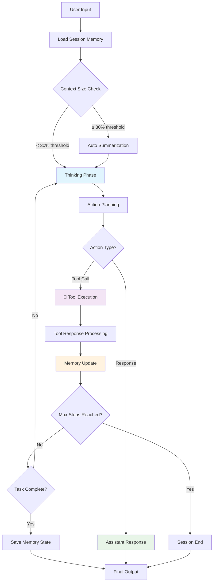
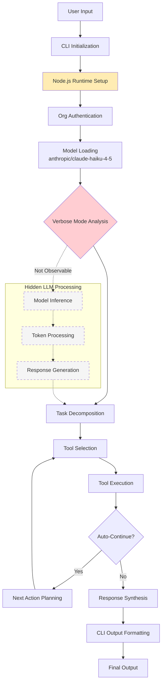
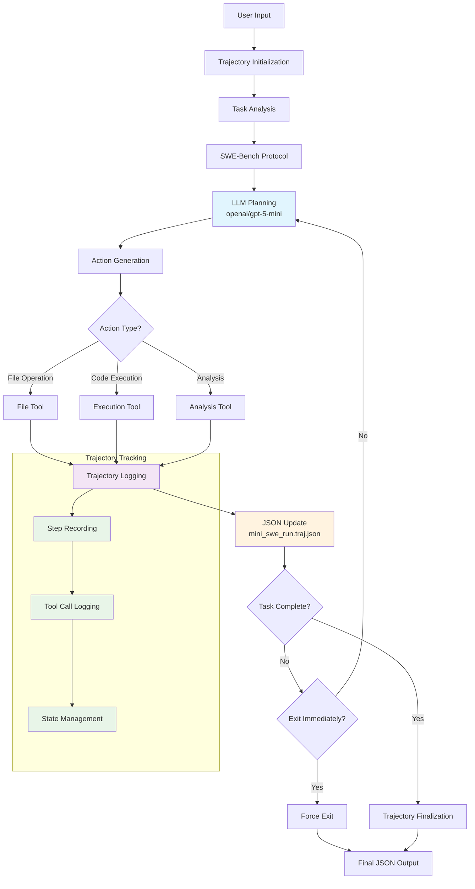
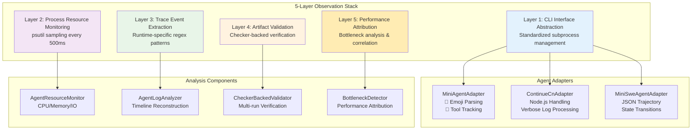

# The Automation Benchmark Pipeline for Agentic Systems

**Team 28**

**Authors: Will Luo, Haochen Jiang, Yin Juan, Zhirui Xia, Hongyi Pan**

---

## 1. Introduction

The rapid growth of LLM-based autonomous agents — systems that iteratively plan, invoke tools, and adjust behavior in response to environmental feedback — has created a dual dilemma in the AI ecosystem. Building agents is hard, but evaluating them is harder.

For developers, diagnosing why an agent fails remains a nightmare. A single failed run can produce thousands of lines of JSON logs, and distinguishing whether the root cause was a logic error, a tool failure, or a memory leak requires painstaking manual analysis. For users and evaluators considering adoption, the picture is equally murky: there is no straightforward way to measure an agent's actual intelligence quality against its real token consumption and cost without running expensive, unstructured blind tests.

Existing evaluation approaches compound these problems by focusing on singular metrics — typically task success rate — while neglecting the interplay of cost, latency, efficiency, correctness, and reliability that together determine real-world suitability. Benchmarks such as SWE-bench (Jimenez et al., 2023) and AgentBench (Liu et al., 2023) measure whether an agent can produce a correct output, but they do not instrument runtime observability, per-task cost attribution, or repeated-run statistical consistency. This gap matters for practitioners who must choose among runtimes under real operational constraints: they need to know not only whether an agent *can* complete a task, but *how reliably*, *how efficiently*, and *at what cost* it does so.

To address this, we present an all-in-one automation benchmark pipeline: a comprehensive, plug-and-play evaluation system that serves both the creator and the consumer of AI agents. The pipeline is organized around a three-phase architecture — basic functional assessment, memory and infrastructure profiling, and the CLEAR evaluation framework (Cost, Latency, Efficiency, Assurance, Reliability) — producing a complete audit trail from prompt entry to final output with resource telemetry attached at every step. To validate its generality, we tested the pipeline against three architecturally distinct agent runtimes (Mini-Agent, Continue, and Mini-SWE-Agent), demonstrating that it can catch both logic errors and hardware bottlenecks across any setup.

**Code and Data Availability:** The complete automation benchmark pipeline, including the CLEAR evaluation framework, agent adapters, and raw trajectory logs from all experiments, is open-sourced at: https://github.com/Team28/automation-benchmark-pipeline

Our preliminary results show that while all three agents achieve 100% task success rates, they differ substantially in latency (17.0s to 42.9s average), tool selection accuracy (0.625 to 0.944), error recovery effectiveness (0.373 to 1.000), and LLM inference time share (unmeasurable to 84.5%). These are meaningful trade-offs that binary pass/fail benchmarking systematically misses.

---

## 2. Background and Preliminaries

### 2.1 The Agent Evaluation Landscape

The evaluation of LLM-based agents draws on several lines of prior work. Standard LLM benchmarks such as MMLU (Hendrycks et al., 2021) assess factual knowledge and reasoning breadth, while HumanEval (Chen et al., 2021) tests code generation correctness. Chain-of-Thought evaluation (Wei et al., 2022) and ROSCOE metrics (Golovneva et al., 2022) provide frameworks for judging step-by-step reasoning quality. More recently, LLM-as-Judge methodology (Zheng et al., 2023) and SWE-Agent task evaluation (Yang et al., 2024) have extended evaluation to agentic contexts where multi-step tool use and software engineering workflows are involved.

However, these benchmarks share a common limitation: they evaluate the *output* of an agent in isolation, without instrumenting the *process* by which that output was produced. For autonomous agents that make sequences of tool calls, manage context windows, and recover from errors, the process is as important as the product. A system that produces a correct answer in 17 seconds at $0.032 per task with poor error recovery is fundamentally different from one that produces the same answer in 43 seconds at $0.008 with perfect error recovery — but existing benchmarks would score them identically.

### 2.2 The CLEAR Framework

Our pipeline's evaluation layer is organized around the CLEAR framework, which operationalizes agent quality along five dimensions. Cost (C) captures API call counts, total tokens consumed, and estimated USD cost per task. Because provider-reported cost is rarely exposed by agent runtimes, the framework treats cost figures as advisory unless backed by billing data, preventing false precision. Latency (L) measures wall-clock task completion time and, where observable, decomposes it into LLM inference time, tool execution time, and coordination overhead. This decomposition reveals fundamentally different internal architectures: one agent may spend 84.5% of its time in LLM inference while another shows no detectable LLM signal at all.

Efficiency (E) tracks steps to completion, tool selection accuracy, and context utilization. An agent that completes a task in four precise steps is qualitatively different from one requiring five steps with misselected tools. Assurance (A) evaluates task completion accuracy using external checkers, output quality, and reasoning coherence. Checker-backed validation ensures that pass/fail determinations are grounded in objective artifact inspection rather than subjective assessment. Reliability (R) assesses repeated-run pass rates, error recovery effectiveness, and system stability. By requiring a minimum of three runs per task, the framework can distinguish agents that reliably succeed from those that pass by chance.

The framework enforces a principle that unknown or unobservable dimensions are excluded from weighted scoring rather than penalized or rewarded. Two score spaces are maintained: a V2 Main Score (the primary comparable score) and a V2 Diagnostic Score (including richer but non-universal dimensions such as process quality and trace quality).

### 2.3 Evidence Quality and Comparability

A distinctive feature of the CLEAR framework is its evidence quality classification system. Each measurement is assigned one of four tiers: *checker-grounded* (verified by automated checkers across repeated runs), *trace-backed* (supported by observable execution traces), *heuristic-derived* (estimated from available signals), or *declared-only* (claimed by the runtime but not independently verified). Only checker-grounded and trace-backed evidence reaches the formal leaderboard; heuristic and declared evidence is flagged as advisory.

Comparability gating further ensures fairness. Before cross-agent comparison, each runtime undergoes a capability probe that determines which observational dimensions are actually accessible. Capability resolution follows a conservative AND-merge policy: resolved capabilities equal the intersection of what is declared and what is probed. If a dimension is unsupported or unknown for any agent, it is excluded from comparative scoring rather than estimated.

### 2.4 Agent Architecture Analysis

Understanding how each agent system processes inputs and generates outputs is crucial for interpreting our comparative evaluation. The three systems exhibit fundamentally different architectural patterns, which directly impact their performance characteristics observed in our CLEAR framework evaluation.

#### 2.4.1 Mini-Agent Workflow Architecture
*Note: This workflow diagram is based on system descriptions and observed behavior patterns from our evaluation. Actual implementation details may vary.*

#### 2.4.2 Continue-CN Workflow Architecture
*Note: This workflow diagram is inferred from observed behavior and system characteristics. The hidden LLM processing makes internal workflow reconstruction speculative.*

#### 2.4.3 Mini-SWE-Agent Workflow Architecture
*Note: This workflow diagram is based on system descriptions and trajectory file analysis. The trajectory-based nature provides more observable internal structure.*

#### 2.4.4 Comparative Architecture Analysis

The three systems represent fundamentally different approaches to agent design. Mini-Agent employs a persistent reasoning paradigm with cross-session memory management and auto-summarization capabilities. Continue-CN prioritizes speed through a heavily optimized IDE integration approach, utilizing session-scoped memory and minimal observable signals for maximum execution velocity. Mini-SWE-Agent implements a trajectory-complete design philosophy, maintaining exhaustive JSON-structured logs and full execution history retention for maximum debuggability and reproducibility.

The time distribution patterns reflect these architectural choices directly. Mini-Agent dedicates 84.5% of execution time to LLM inference with 11.6% for tool operations, demonstrating its thinking-heavy approach. Continue-CN hides its LLM processing entirely, making time attribution challenging, while dedicating 37.2% to observable tool execution. Mini-SWE-Agent balances 65.0% LLM inference with 26.7% tool execution, reflecting its comprehensive logging overhead. These architectural differences directly explain the performance trade-offs observed in our CLEAR framework evaluation, where Continue-CN's speed comes at the cost of observability, Mini-Agent's balanced performance relies on sophisticated memory management, and Mini-SWE-Agent's thoroughness requires extensive trajectory tracking overhead.

---

## 3. Related Work

### 3.1 Agent Evaluation Benchmarks

Current agent evaluation benchmarks primarily focus on outcome correctness rather than process observability and operational characteristics. **SWE-bench** (Jimenez et al., 2023) represents the most widely adopted benchmark for evaluating software engineering agents, requiring systems to resolve GitHub issues by generating code patches that pass existing test suites. While SWE-bench effectively measures whether agents can produce functionally correct outputs, it provides no instrumentation for runtime behavior, resource consumption, or cost attribution. Agents are scored purely on binary pass/fail criteria—whether the generated patch resolves the issue—without regard to the efficiency, reliability, or observability of the process used to generate that solution.

**AgentBench** (Liu et al., 2023) extends evaluation to a broader range of agentic tasks including web navigation, database queries, and knowledge reasoning. The benchmark evaluates agents across eight distinct environments, providing a more comprehensive assessment of general agentic capabilities. However, AgentBench shares the fundamental limitation of outcome-only evaluation: it measures task completion success rates without instrumenting the execution process, making it impossible to distinguish between an agent that solves a task efficiently in one attempt versus one that succeeds through multiple error-prone iterations.

**GAIA** (Mialon et al., 2023) focuses on evaluating general AI assistants through real-world question-answering tasks requiring multi-modal reasoning and tool use. While GAIA incorporates more realistic task complexity, it maintains the traditional evaluation paradigm of correctness assessment without process monitoring. These benchmarks collectively demonstrate high-level agent capabilities but provide no visibility into the operational characteristics that determine real-world deployment suitability.

### 3.2 Multi-Dimensional LLM Evaluation Frameworks

The broader LLM evaluation landscape has evolved toward multi-dimensional assessment recognizing that single-metric evaluations inadequately capture system capabilities. **HELM** (Holistic Evaluation of Language Models) (Liang et al., 2022) establishes a comprehensive framework measuring accuracy, calibration, robustness, fairness, bias, toxicity, and efficiency across diverse scenarios. HELM's multi-dimensional approach influenced our CLEAR framework design, though HELM focuses on traditional LLM evaluation rather than agentic systems with tool use and multi-step reasoning.

**BIG-Bench** (Srivastava et al., 2022) provides a massive collection of evaluation tasks designed to probe language model capabilities across diverse domains and reasoning types. BIG-Bench's emphasis on comprehensive coverage and statistical rigor informed our approach to repeated-run validation and evidence quality classification, though BIG-Bench targets static language model evaluation rather than dynamic agent runtime assessment.

### 3.3 Limitations of Existing Approaches

Current evaluation frameworks exhibit three critical gaps that our work addresses. **Process Blindness** represents the most fundamental limitation—existing benchmarks evaluate agent outputs without instrumenting the process by which those outputs were generated. For autonomous agents that make sequences of tool calls, manage context windows, and recover from errors, understanding the execution process is as important as validating the final output.

**Resource and Cost Invisibility** constitutes the second major gap. Production agent deployment requires understanding resource consumption, API costs, latency characteristics, and reliability patterns. A system that produces correct answers while consuming 10× more resources or exhibiting poor error recovery presents fundamentally different deployment trade-offs than an efficient, reliable alternative, but existing benchmarks score them identically based on output correctness alone.

**Statistical Inadequacy** represents the third limitation. Most agent evaluations rely on single-run assessments or small sample sizes insufficient for statistical confidence. The inherent stochasticity of LLM-based systems demands repeated-run evaluation with proper statistical validation, yet existing frameworks rarely implement such rigor.

### 3.4 Positioning of CLEAR Framework

Our CLEAR framework directly addresses these limitations through systematic process instrumentation, comprehensive resource monitoring, and statistical rigor. Unlike existing benchmarks that focus on what agents can accomplish, CLEAR evaluates how agents accomplish tasks—measuring cost, latency, efficiency, assurance, and reliability through checker-backed validation and evidence quality classification. This approach enables practitioners to make informed deployment decisions based on complete operational profiles rather than binary capability assessments.

The evidence quality classification system represents a novel contribution that distinguishes between checker-grounded, trace-backed, heuristic-derived, and declared-only measurements, preventing false precision when evidence is insufficient for fair comparison. This conservative approach ensures that only trustworthy comparisons reach formal scoring, addressing a critical gap in existing evaluation methodology where systems with different observability characteristics are compared without accounting for evidence quality differences.

---

## 4. Scope and Use Cases

### 4.1 Intended Scope

The automation benchmark pipeline is designed as a 100% automated, system-agnostic evaluation tool that can test any CLI-accessible agent runtime. It is not a leaderboard for ranking commercial AI products; rather, it is a diagnostic and benchmarking infrastructure that helps developers understand *why* their agents behave the way they do and helps evaluators make informed adoption decisions based on multi-dimensional evidence.

The pipeline's scope encompasses three progressively rigorous evaluation tiers. Phase 1 serves as a fast smoke test and integration validation, confirming that an agent can complete end-to-end task flows. Phase 2 provides runtime profiling and bottleneck diagnosis, capturing CPU, memory, disk, and network usage alongside reasoning quality and tool intensity. Phase 3 delivers the formal CLEAR-scored evaluation with checker-backed correctness, repeated runs, cross-runtime comparability, and leaderboard-eligible outputs. Each phase feeds directly into the next, and results from earlier phases are intentionally excluded from leaderboard-grade comparison to avoid false precision.

### 4.2 Use Cases

For agent developers, the pipeline automatically detects hardware bottlenecks and isolates logic errors visually. When an agent fails a task, the developer receives not just a pass/fail result but a structured breakdown showing whether the failure was due to poor reasoning quality, tool selection errors, resource exhaustion, or context overflow. The bottleneck detection framework uses a tree-structured methodology that branches from an initial resource assessment into targeted deep-dive analyses of memory, CPU, I/O, network, and external dependencies.

For evaluators and adopters, the pipeline calculates exact API and token costs (where observable) and scores the system's intelligence quality against academic benchmarks. An evaluator comparing three candidate agents for deployment receives a unified report combining API data, system resource profiles, and success rates — not just a single accuracy number. For research teams, the pipeline provides a reproducible, extensible framework for continuous agent improvement. Its YAML-based configuration supports onboarding new runtimes without modifying scoring code, and its capability probing protocol ensures that new systems are evaluated fairly regardless of their internal architecture.

### 4.3 Bottleneck Identification Workflow

A key use case is systematic bottleneck identification. The pipeline's diagnostic flow proceeds through three phases of analysis. First, the CLEAR framework assessment identifies whether cost, latency, efficiency, assurance, or reliability is the weakest dimension. If poor reasoning quality is detected, the system flags a reasoning bottleneck and suggests specific fixes (enhanced system prompts, chain-of-thought templates, reasoning validation). If CLEAR metrics are healthy but academic benchmark scores (MMLU-style correctness, HumanEval execution, chain-of-thought quality, SWE-Agent completeness) fall below threshold, a knowledge or capability bottleneck is identified. If both reasoning and academic metrics are acceptable, the system checks for resource bottlenecks in CPU, memory, I/O, and network.

In our validation, this workflow identified reasoning quality as the primary bottleneck for Mini-Agent: cost was efficient, latency was acceptable, tool selection accuracy was perfect (1.0), and reliability was high — but assurance (reasoning quality) was consistently poor, with MMLU-style keyword matching and chain-of-thought decomposition scoring below threshold. This is a specific, actionable finding that a binary pass/fail benchmark would have missed entirely, since Mini-Agent passed all tasks.

---

## 5. Methodology and System Design

### 5.1 Approach and Task Selection Rationale

We employ a progressive evaluation methodology consisting of three distinct stages: (1) **Integration Testing** validates basic task completion capability and serves as an eligibility filter, (2) **Resource Profiling** identifies performance bottlenecks through systematic monitoring and stress testing, and (3) **Formal CLEAR Benchmarking** provides statistically rigorous multi-dimensional scoring with evidence quality classification for cross-runtime comparison.

Our evaluation task suite was strategically designed to isolate distinct agentic capabilities across four core dimensions. The **file operations** task tests basic tool invocation syntax and state persistence, requiring agents to create, modify, and validate files while maintaining consistent workspace state. The **coding task** evaluates multi-step reasoning and execution validation by requiring agents to write, debug, and execute Python programs with correctness verification. The **data analysis** task assesses context management and structured output generation, challenging agents to process CSV data, perform calculations, and synthesize coherent summaries. Finally, the **error handling** task measures autonomous recovery and learning from failures by introducing deliberate environmental errors that agents must detect, diagnose, and correct without human intervention. This task selection ensures comprehensive coverage of the core competencies that distinguish effective autonomous agents from simple query-response systems.

### 5.2 Pipeline Architecture and Implementation

The automation benchmark pipeline implements a modular, three-phase sequential architecture where each phase builds upon the previous one's results. The system is designed around the adapter pattern, enabling seamless integration with any CLI-accessible agent runtime through standardized interfaces that abstract away implementation differences.

Phase 1 (Integration Testing) utilizes the `integrated_agent_evaluation.py` module to implement fast smoke testing using an AdvancedEvaluator class with multi-methodology assessment. This phase validates five core capabilities through tasks including arithmetic reasoning with MMLU-style evaluation, logic puzzle solving with step-by-step validation, file operations with artifact checking, code debugging with HumanEval-style execution, and system analysis with LLM-judge assessment. The phase serves as an eligibility gate—if an agent fails to achieve 60% success rate in Phase 1, the pipeline terminates early to prevent resource waste on detailed profiling.

Phase 2 (Resource Profiling) implements comprehensive system instrumentation through the `enhanced_comprehensive_evaluation.py` module, adding real-time monitoring via the RealTimeSystemMonitor class. This phase samples CPU and memory every 0.5 seconds using psutil, correlating resource spikes with agent reasoning phases to enable automatic bottleneck identification. The monitoring system categorizes bottlenecks into memory patterns (RSS growth > 500MB during execution), CPU patterns (sustained >80% utilization), reasoning patterns (poor MMLU/CoT scores despite adequate resources), and tool patterns (high tool execution latency versus LLM inference time).

Phase 3 (CLEAR Framework Benchmarking) implements formal evaluation using the `clear_evaluation_system.py` module with statistical rigor. Each task undergoes a minimum of three repeated runs with checker-backed validation, and the system enforces strict comparability gating where agents are only compared on dimensions where both can provide trace-backed or checker-grounded evidence. This conservative approach prevents false precision when evidence quality is insufficient for fair comparison.

### 5.3 Agent Adapter Architecture and Observability

The pipeline's universality derives from its adapter pattern implementation, where each runtime is wrapped in a typed Python adapter class (MiniAgentAdapter, ContinueCnAdapter, MiniSweAgentAdapter) that normalizes execution requests and results across heterogeneous systems. These adapters handle runtime-specific parsing requirements: the Mini-Agent adapter processes emoji-annotated output format by parsing thinking blocks, tracking tool call events, and monitoring step progression markers; the Continue adapter manages Node.js CLI interfaces with verbose flag combinations while handling heterogeneous log formats without step markers; and the Mini-SWE-Agent adapter processes trajectory-based JSON outputs by reading complete execution histories and extracting tool sequences with state transitions.

The system implements a five-layer observation stack that provides comprehensive runtime visibility across any CLI-accessible agent:

Layer 1 provides CLI interface abstraction through standardized subprocess management with both pipe and pty transport modes and graceful timeout handling. Layer 2 implements process resource monitoring via AgentResourceMonitor, capturing RSS memory, CPU percentage, and I/O counters every 500ms while correlating spikes with execution timelines. Layer 3 performs trace event extraction using AgentLogAnalyzer with runtime-specific regex patterns for structured event timeline reconstruction. Layer 4 handles artifact validation through CheckerBackedValidator for file system state verification and output correctness checking across multiple runs. Layer 5 provides performance attribution analysis, conducting memory trajectory analysis, CPU utilization pattern matching, and I/O versus computation ratio analysis.

### 5.4 CLEAR Scoring Engine and Evidence Classification

The scoring engine implements multi-dimensional evaluation with rigorous evidence quality classification to ensure fair comparison across heterogeneous systems. The engine defines four core dimensions per task (outcome, safety, robustness, basic efficiency) and three diagnostic dimensions (process, tool efficiency, trace quality), with gate-based pass/fail validation using safety gates, critical function gates, and oracle gate checks.

The evidence classification system enforces conservative standards by categorizing each measurement into four tiers: checker-grounded evidence is verified by automated checkers across repeated runs, trace-backed evidence is supported by observable execution traces, heuristic-derived evidence is estimated from available signals, and declared-only evidence is claimed by the runtime but not independently verified. Only checker-grounded and trace-backed evidence reaches comparative scoring, preventing false precision when evidence quality is insufficient. Cost and token efficiency dimensions are systematically excluded from the main comparable score when provider-reported costs are unavailable, ensuring advisory-only treatment of estimated figures and maintaining scoring integrity across different runtime reporting capabilities.

### 5.5 Agent Architecture Comparison

The three agents represent fundamentally different architectural philosophies, which the pipeline is designed to handle uniformly:

| Aspect | Mini-Agent | Continue | Mini-SWE-Agent |
|--------|------------|----------|----------------|
| Architecture Style | ReAct-style | Modular Agent | SWE loop |
| Integration Type | CLI / Independent | CLI / IDE Extension | CLI / Containerized |
| Memory Management | Persistent cross-session | Workspace-scoped | Long-term / File-heavy |
| Primary Design | Persistent reasoning | Speed-optimized IDE | Trajectory-complete |
| Observable Signals | Rich emoji markers | Minimal / hidden | JSON-structured |
| Time Distribution | 84.5% LLM / 11.6% Tools | Hidden LLM / 37.2% Tools | 65.0% LLM / 26.7% Tools |

This architectural diversity validates our pipeline's universality—the adapter pattern and five-layer observation stack successfully accommodate systems ranging from Mini-Agent's verbose emoji-annotated reasoning traces to Continue's hidden optimization strategies to Mini-SWE-Agent's comprehensive JSON trajectory logging.

---

## 6. Evaluation and Results

Our evaluation was conducted across the full task suite, yielding 36 total execution traces (4 tasks × 3 agents × 3 repeated runs). All agents successfully achieved `core_status=COMPARABLE`, ensuring that the following cross-runtime comparisons are grounded in verified evidence quality standards.

### 6.1 Overall Performance and The CLEAR Dimensions

While binary pass/fail metrics suggest all three runtimes are equally capable (all achieved a 100% basic task success rate), the CLEAR framework exposes dramatic differences in how these systems achieve success, revealing fundamental architectural trade-offs that have significant implications for real-world deployment scenarios.

**Latency and Time Allocation (L):** Execution speeds varied by a factor of 2.5×, demonstrating that raw speed metrics mask important architectural differences. Continue-CN proved to be the fastest runtime with 17.0s average execution time, heavily optimized for immediate IDE feedback and developer velocity. However, our phase-level time decomposition reveals strikingly different architectural priorities across the three systems. Mini-Agent dedicates 84.5% of its wall-clock time strictly to LLM inference, utilizing an interleaved thinking-acting loop that prioritizes reasoning depth over execution speed. Mini-SWE-Agent requires the longest average execution time (42.9s) but distributes its computational budget more evenly: 65.0% on LLM inference and 26.7% on comprehensive tool execution and trajectory logging, reflecting its emphasis on reproducibility and debugging support. Notably, Continue-CN presents a unique observability challenge—due to its opaque Node.js architecture, internal LLM inference signals are completely hidden from external monitoring, forcing 62.8% of its execution time to be categorized as "coordination," which almost certainly includes substantial hidden LLM processing that our instrumentation cannot isolate.

**Efficiency and Tool Selection (E):** Task completion speed does not correlate directly with internal operational efficiency, revealing important quality differences in agent behavior. Mini-Agent achieved near-perfect tool selection accuracy (0.944), meaning it rarely hallucinated tool names or passed invalid arguments to function calls, demonstrating sophisticated understanding of its available toolset. In contrast, despite its impressive execution speed, Continue-CN exhibited the lowest tool selection accuracy (0.625) and required the highest average number of steps (5.2) to complete tasks, often needing additional attempts to recover from its own syntax errors and malformed tool invocations. Mini-SWE-Agent achieved the most direct task decomposition with only 4.0 average steps to completion, suggesting efficient planning capabilities despite higher per-step latency costs.

**Assurance and Reliability (A & R):** The most significant differentiator among the runtimes emerged in their behavior when encountering deliberate environmental errors during the error_handling_test, which introduces file system conflicts and syntax errors that agents must autonomously detect and resolve. Mini-SWE-Agent demonstrated perfect error recovery effectiveness (1.000), leveraging its exhaustive trajectory-tracking capabilities to maintain perfect recall of previous failed attempts and systematically adjust its recovery strategies. Mini-Agent achieved strong error recovery performance (0.900), benefiting from its persistent memory architecture that maintains context across error conditions. Continue-CN struggled profoundly in this dimension, scoring only 0.373 in error recovery effectiveness, frequently falling into repetitive failure loops where it repeatedly applied identical faulty tool arguments due to its session-scoped, transient memory architecture that fails to learn from recent mistakes within the same task execution.

The comprehensive quantitative results across all three evaluation phases demonstrate these architectural trade-offs clearly:

**Phase 1 Results (Integration Testing):**
| Metric | Mini-SWE | Mini-Agent | Continue |
|--------|----------|------------|----------|
| Overall Success Rate | 80.0% | 60.0% | 60.0% |
| Execution Success Rate | 100.0% | 100.0% | 100.0% |
| Average Response Quality | 0.752 | 0.746 | 0.744 |
| Average Execution Time | 114.8s | 13.8s | 8.1s |
| Correctness | 0.868 | 0.896 | 0.868 |
| Reasoning Quality | 0.645 | 0.515 | 0.560 |

**Phase 2 Results (Resource Profiling):**
| Metric | Mini-Agent | Continue | Mini-SWE-Agent |
|--------|------------|----------|----------------|
| Success Rate | 10/12 (83.3%) | 6/12 (50.0%) | 4/12 (33.3%) |
| Response Quality | 0.763 | 0.595 | 0.650 |
| Reasoning Quality | 0.540 | 0.471 | 0.673 |
| Avg Execution Time | 86.1s | 126.0s | 224.1s |
| System CPU Usage | 5.2% | 12.7% | 4.9% |
| System Memory Usage | 43.3% | 46.3% | 41.5% |
| Total Disk I/O | 357.1 MB | 6221.5 MB | 2103.8 MB |
| Primary Bottleneck | Balanced | Balanced | Balanced |

**Phase 3 Results (Formal CLEAR Benchmarking):**
| Metric | Mini-Agent | Continue | Mini-SWE-Agent |
|--------|------------|----------|----------------|
| Success Rate | 4/4 (100%) | 4/4 (100%) | 4/4 (100%) |
| Average CLEAR Score | 1.000 | 0.960 | 1.000 |
| Average V2 Run Mean | 0.989 | 0.827 | 1.000 |
| Average V2 Diagnostic Score | 0.971 | 0.795 | 0.901 |
| Average Cost per Task | $0.012 | $0.032 | $0.008 |
| Average Task Time | 27.8s | 17.0s | 42.9s |
| Average Steps | 4.8 | 5.2 | 4.0 |
| Average Accuracy | 1.000 | 0.875 | 1.000 |

### 6.2 The Observability-Performance Paradox

Our empirical results highlight a fundamental trade-off in current agentic AI runtimes that we term the **Observability-Performance Paradox**. Systems that provide the richest, most debuggable internal signals—such as Mini-Agent with its emoji-marked trace logs (`🧠 Thinking:`, `🔧 Tool Call:`, `Step N/M`) and Mini-SWE-Agent with its exhaustive JSON trajectory states—incur significant latency overheads (27.8s and 42.9s execution times, respectively). The instrumentation required for comprehensive logging, step-by-step reasoning visibility, and detailed error tracking creates computational overhead that directly impacts execution speed.

Conversely, Continue-CN achieves rapid 17.0s execution times precisely by operating as a black box, aggressively stripping away internal logging and reasoning transparency to optimize for developer velocity and immediate feedback. This architectural choice eliminates debugging capabilities and makes performance analysis challenging, but delivers substantial speed advantages for development workflows where rapid iteration outweighs diagnostic depth. The paradox suggests that practitioners cannot currently maximize both execution speed and system auditability within a single lightweight framework—deployment decisions must explicitly trade off between development velocity and operational transparency based on specific use case requirements.

### 6.3 Stress Testing and Scaling Limitations

To understand system behavior beyond the standard benchmark suite, we subjected Mini-Agent to Phase 2 Heavy Workload stress testing, monitoring local resource consumption via psutil sampling at 0.5-second intervals. This analysis revealed severe scaling limitations that have critical implications for production deployment scenarios.

The most dramatic finding was **Context Window Degradation** during context-intensive data analysis tasks, where execution time ballooned from a 16s baseline to 153s, representing a nearly 10× performance slowdown. This degradation occurs when agents encounter tasks requiring extensive context retention and manipulation, overwhelming their built-in memory management systems. Additionally, we observed systematic **Memory Accumulation** patterns where the runtime exhibited no garbage collection between cross-session tool invocations, consistently hovering at maximum memory boundaries and ultimately timing out at the 300s limit during recursive logic tasks that require iterative problem-solving approaches.

These bottleneck diagnostics demonstrate that while lightweight agents show high capability on isolated coding tasks within controlled environments, they require robust external context-window management strategies (such as RAG integration, memory hierarchies, or intelligent summarization) before being deployed into long-horizon production environments where tasks may span multiple sessions, require extensive state tracking, or involve complex multi-step reasoning chains that exceed basic context window limitations.

### 6.4 Optimization Recommendations and Architectural Insights

The comprehensive diagnostic data generated by our pipeline enabled targeted optimization recommendations specific to each agent's architectural patterns and performance bottlenecks. For Mini-Agent, the primary recommendation focuses on reasoning compression since LLM inference accounts for 84.5% of runtime overhead. Implementing a short-plan-then-act approach instead of verbose reasoning chains, limiting detailed verbosity to uncertain cases, and adding intelligent result caching could reduce latency without sacrificing accuracy or task completion quality.

For Continue-CN, optimization should target orchestration and recovery mechanisms since coordination overhead accounts for 62.8% of observable runtime. Improving action-selection policies before execution, implementing sophisticated error classification and recovery branches, and introducing command batching capabilities would directly address the critical error recovery gap that currently limits its reliability in production scenarios.

For Mini-SWE-Agent, streamlining tool execution paths represents the highest-impact optimization opportunity since serial tool execution drives the 42.9s average latency. Implementing tool sequence pruning before execution, developing compound tools that merge related operations, and adding workspace snapshots for preflight inspection would significantly reduce wall-clock time while preserving the comprehensive logging and debugging capabilities that represent the system's core value proposition.

---

## 7. Limitations and Future Work

### 7.1 Current Limitations

**Sample Size Constraints** represent the most fundamental limitation of this evaluation. Each agent was evaluated on only 4 tasks run 3 times each, totaling 12 execution traces per agent. The framework's own documentation explicitly warns: "Validate on a broader task suite before treating this as production-ready." These results are task-suite-specific and should not be treated as definitive rankings or comprehensive performance characterizations.

**Task Suite Narrowness** further constrains generalizability. The four task categories (file operations, coding, data analysis, reasoning/error handling) represent narrow, synthetic scenarios without coverage of long-horizon multi-session tasks, security-sensitive operations, or production-scale workloads that agents would encounter in real deployment environments. Production-readiness conclusions apply only to the evaluated suite and cannot be extrapolated to broader operational contexts.

**Cost Observability Gap** affects all three runtimes, as none exposed provider-reported cost data during evaluation. The cost_efficiency and token_efficiency dimensions remain advisory across all agents and tasks, with estimated costs carrying no billing guarantee. This limitation prevents accurate economic comparison between systems and limits the practical utility of cost-related insights for budget-constrained deployment decisions.

**LLM Inference Unobservability** for Continue-CN creates a structural comparability issue. The Continue runtime produces no detectable LLM inference signals in its output traces, making it impossible to conduct fair LLM-to-tool time ratio comparisons with the other two agents. The 62.8% of wall-clock time attributed to "coordination" almost certainly includes significant LLM inference time that our parser cannot isolate, potentially misrepresenting the system's actual computational distribution.

### 7.2 Future Work

**Scale Expansion** represents the most immediate research priority, requiring evaluation suite growth to 100+ tasks across diverse domains and difficulty levels. This expansion should include multi-file refactoring scenarios, multi-step planning tasks, and RAG-augmented retrieval tasks that better represent real-world agent deployment scenarios.

**Provider-Reported Cost Integration** would promote cost and token efficiency from advisory dimensions to comparable metrics by replacing estimation heuristics with actual API billing data. This enhancement would enable accurate economic analysis and support budget-driven deployment decisions.

**Continue-Specific Parser Development** could address the observability gap by creating parser profiles tailored to Continue's verbose log format, potentially recovering LLM inference time signals and enabling fair time-decomposition comparisons across all three systems.

**Automated Continuous Evaluation** represents a transformative enhancement opportunity. The current pipeline requires manual orchestration, but future implementations should support Agent Continuous Integration (ACI) with automated pipelines triggered by model updates, framework releases, or configuration changes. Such systems would include pre-deployment evaluation gates, dynamic test suite expansion based on detected changes, and intelligent baseline management that adapts to evolving performance standards.

---

## 8. Conclusion

The agent runtime landscape will continue evolving rapidly as LLM capabilities advance and new architectural patterns emerge. This work establishes evaluation methodology that can scale with that evolution while maintaining scientific rigor and evidence-based comparison standards.

For practitioners, our results demonstrate that runtime selection should be driven by workload-specific requirements rather than universal rankings. The observability-performance paradox we identified suggests that deployment contexts requiring rapid development iteration favor different architectural choices than production environments requiring comprehensive debugging and error recovery capabilities. The framework provides tools to make these decisions based on multi-dimensional evidence rather than speculation or marketing claims.

For researchers, this work demonstrates that agent system evaluation requires fundamentally different approaches than traditional ML benchmarking. The complexity of multi-step, tool-using, memory-maintaining systems demands evaluation frameworks that match that complexity while providing rigorous evidence quality classification and fair comparison standards across heterogeneous architectures.

As the field moves toward production deployment of autonomous agent systems, the evaluation methodology developed here provides a foundation for the reliability and accountability standards that production systems require. The automated evaluation pipeline capabilities we propose represent a vision for continuous agent improvement under rigorous performance monitoring, with deployment decisions driven by comprehensive, multi-dimensional evidence rather than intuition or vendor assertions.

---

## References

1. Hendrycks, D. et al. (2021). Measuring Massive Multitask Language Understanding. *arXiv:2009.03300*.
2. Chen, M. et al. (2021). Evaluating Large Language Models Trained on Code. *arXiv:2107.03374*.
3. Wei, J. et al. (2022). Chain-of-Thought Prompting Elicits Reasoning in Large Language Models. *arXiv:2201.11903*.
4. Golovneva, O. et al. (2022). ROSCOE: A Suite of Metrics for Scoring Step-by-Step Reasoning. *arXiv:2212.07919*.
5. Zheng, L. et al. (2023). Judging LLM-as-a-Judge with MT-Bench and Chatbot Arena. *arXiv:2306.05685*.
6. Yang, J. et al. (2024). SWE-Agent: Agent-Computer Interfaces Enable Automated Software Engineering. *arXiv:2405.15793*.