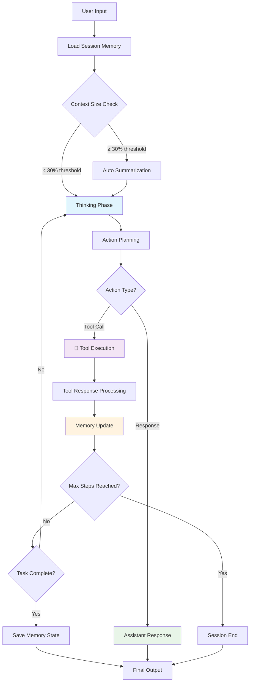
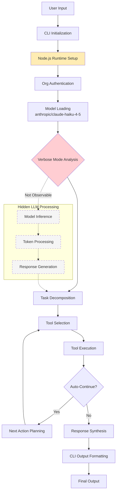
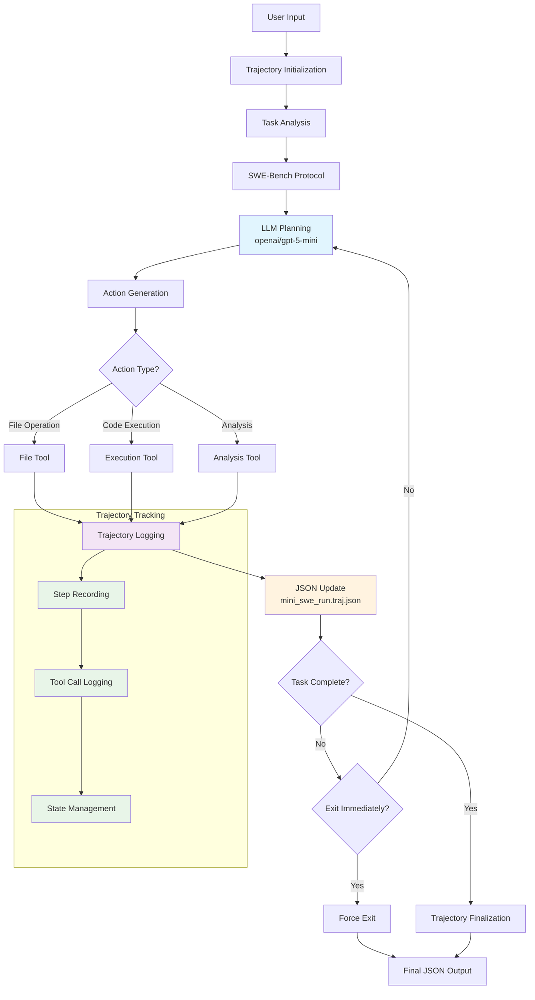

# The Automation Benchmark Pipeline for Agentic Systems

**Team 28**

**Authors: Will Luo, Haochen Jiang, Yin Juan, Zhirui Xia, Hongyi Pan**

---

## 1. Introduction

The rapid growth of LLM-based autonomous agents — systems that iteratively plan, invoke tools, and adjust behavior in response to environmental feedback — has created a dual dilemma in the AI ecosystem. Building agents is hard, but evaluating them is harder.

For developers, diagnosing why an agent fails remains a nightmare. A single failed run can produce thousands of lines of JSON logs, and distinguishing whether the root cause was a logic error, a tool failure, or a memory leak requires painstaking manual analysis. For users and evaluators considering adoption, the picture is equally murky: there is no straightforward way to measure an agent's actual intelligence quality against its real token consumption and cost without running expensive, unstructured blind tests.

Existing evaluation approaches compound these problems by focusing on singular metrics — typically task success rate — while neglecting the interplay of cost, latency, efficiency, correctness, and reliability that together determine real-world suitability. Benchmarks such as SWE-bench (Jimenez et al., 2023) and AgentBench (Liu et al., 2023) measure whether an agent can produce a correct output, but they do not instrument runtime observability, per-task cost attribution, or repeated-run statistical consistency. This gap matters for practitioners who must choose among runtimes under real operational constraints: they need to know not only whether an agent *can* complete a task, but *how reliably*, *how efficiently*, and *at what cost* it does so.

To address this, we present an all-in-one automation benchmark pipeline: a comprehensive, plug-and-play evaluation system that serves both the creator and the consumer of AI agents. The pipeline is organized around a three-phase architecture — basic functional assessment, memory and infrastructure profiling, and the CLEAR evaluation framework (Cost, Latency, Efficiency, Assurance, Reliability) — producing a complete audit trail from prompt entry to final output with resource telemetry attached at every step. To validate its generality, we tested the pipeline against three architecturally distinct agent runtimes (Mini-Agent, Continue, and Mini-SWE-Agent), demonstrating that it can catch both logic errors and hardware bottlenecks across any setup.

Our preliminary results show that while all three agents achieve 100% task success rates, they differ substantially in latency (17.0s to 42.9s average), tool selection accuracy (0.625 to 0.944), error recovery effectiveness (0.373 to 1.000), and LLM inference time share (unmeasurable to 84.5%). These are meaningful trade-offs that binary pass/fail benchmarking systematically misses.

---

## 2. Background and Preliminaries

### 2.1 The Agent Evaluation Landscape

The evaluation of LLM-based agents draws on several lines of prior work. Standard LLM benchmarks such as MMLU (Hendrycks et al., 2021) assess factual knowledge and reasoning breadth, while HumanEval (Chen et al., 2021) tests code generation correctness. Chain-of-Thought evaluation (Wei et al., 2022) and ROSCOE metrics (Golovneva et al., 2022) provide frameworks for judging step-by-step reasoning quality. More recently, LLM-as-Judge methodology (Zheng et al., 2023) and SWE-Agent task evaluation (Yang et al., 2024) have extended evaluation to agentic contexts where multi-step tool use and software engineering workflows are involved.

However, these benchmarks share a common limitation: they evaluate the *output* of an agent in isolation, without instrumenting the *process* by which that output was produced. For autonomous agents that make sequences of tool calls, manage context windows, and recover from errors, the process is as important as the product. A system that produces a correct answer in 17 seconds at $0.032 per task with poor error recovery is fundamentally different from one that produces the same answer in 43 seconds at $0.008 with perfect error recovery — but existing benchmarks would score them identically.

### 2.2 The CLEAR Framework

Our pipeline's evaluation layer is organized around the CLEAR framework, which operationalizes agent quality along five dimensions:

**Cost (C)** captures API call counts, total tokens consumed, and estimated USD cost per task. Because provider-reported cost is rarely exposed by agent runtimes, the framework treats cost figures as advisory unless backed by billing data, preventing false precision.

**Latency (L)** measures wall-clock task completion time and, where observable, decomposes it into LLM inference time, tool execution time, and coordination overhead. This decomposition reveals fundamentally different internal architectures: one agent may spend 84.5% of its time in LLM inference while another shows no detectable LLM signal at all.

**Efficiency (E)** tracks steps to completion, tool selection accuracy, and context utilization. An agent that completes a task in four precise steps is qualitatively different from one requiring five steps with misselected tools.

**Assurance (A)** evaluates task completion accuracy using external checkers, output quality, and reasoning coherence. Checker-backed validation ensures that pass/fail determinations are grounded in objective artifact inspection rather than subjective assessment.

**Reliability (R)** assesses repeated-run pass rates, error recovery effectiveness, and system stability. By requiring a minimum of three runs per task, the framework can distinguish agents that reliably succeed from those that pass by chance.

The framework enforces a principle that unknown or unobservable dimensions are excluded from weighted scoring rather than penalized or rewarded. Two score spaces are maintained: a V2 Main Score (the primary comparable score) and a V2 Diagnostic Score (including richer but non-universal dimensions such as process quality and trace quality).

### 2.3 Evidence Quality and Comparability

A distinctive feature of the CLEAR framework is its evidence quality classification system. Each measurement is assigned one of four tiers: *checker-grounded* (verified by automated checkers across repeated runs), *trace-backed* (supported by observable execution traces), *heuristic-derived* (estimated from available signals), or *declared-only* (claimed by the runtime but not independently verified). Only checker-grounded and trace-backed evidence reaches the formal leaderboard; heuristic and declared evidence is flagged as advisory.

Comparability gating further ensures fairness. Before cross-agent comparison, each runtime undergoes a capability probe that determines which observational dimensions are actually accessible. Capability resolution follows a conservative AND-merge policy: resolved capabilities equal the intersection of what is declared and what is probed. If a dimension is unsupported or unknown for any agent, it is excluded from comparative scoring rather than estimated.

### 2.4 Agent Architecture Analysis

Understanding how each agent system processes inputs and generates outputs is crucial for interpreting our comparative evaluation. The three systems exhibit fundamentally different architectural patterns, which directly impact their performance characteristics observed in our CLEAR framework evaluation.

#### 2.4.1 Mini-Agent Workflow Architecture
*Note: This workflow diagram is based on system descriptions and observed behavior patterns from our evaluation. Actual implementation details may vary.*

#### 2.4.2 Continue-CN Workflow Architecture
*Note: This workflow diagram is inferred from observed behavior and system characteristics. The hidden LLM processing makes internal workflow reconstruction speculative.*

#### 2.4.3 Mini-SWE-Agent Workflow Architecture
*Note: This workflow diagram is based on system descriptions and trajectory file analysis. The trajectory-based nature provides more observable internal structure.*

#### 2.4.4 Comparative Architecture Analysis

| Aspect | Mini-Agent | Continue-CN | Mini-SWE-Agent |
|--------|------------|-------------|-----------------|
| **Primary Design** | Persistent reasoning | Speed-optimized IDE | Trajectory-complete |
| **Memory Strategy** | Cross-session persistence | Session-scoped | Full trajectory log |
| **Observable Signals** | Rich emoji markers | Minimal/hidden | JSON-structured |
| **Time Distribution** | 84.5% LLM / 11.6% Tools (Section 5.3) | Hidden LLM / 37.2% Tools (Section 6.1) | 65.0% LLM / 26.7% Tools (Section 5.3) |
| **Context Management** | Auto-summarization | Runtime-handled | Full retention |
| **Execution Model** | Step-limited loop | Auto-continue | Exit-immediate |

These architectural differences directly explain the performance trade-offs observed in our CLEAR framework evaluation: Continue-CN's speed comes at the cost of observability (Section 6.1), Mini-Agent's balanced performance relies on sophisticated memory management (Section 4.2), and Mini-SWE-Agent's thoroughness requires extensive trajectory tracking overhead (Section 5.4).

---

## 3. Scope and Use Cases

### 3.1 Intended Scope

The automation benchmark pipeline is designed as a 100% automated, system-agnostic evaluation tool that can test any CLI-accessible agent runtime. It is not a leaderboard for ranking commercial AI products; rather, it is a diagnostic and benchmarking infrastructure that helps developers understand *why* their agents behave the way they do and helps evaluators make informed adoption decisions based on multi-dimensional evidence.

The pipeline's scope encompasses three progressively rigorous evaluation tiers. Phase 1 serves as a fast smoke test and integration validation, confirming that an agent can complete end-to-end task flows. Phase 2 provides runtime profiling and bottleneck diagnosis, capturing CPU, memory, disk, and network usage alongside reasoning quality and tool intensity. Phase 3 delivers the formal CLEAR-scored evaluation with checker-backed correctness, repeated runs, cross-runtime comparability, and leaderboard-eligible outputs. Each phase feeds directly into the next, and results from earlier phases are intentionally excluded from leaderboard-grade comparison to avoid false precision.

### 3.2 Use Cases

**For Agent Developers:** The pipeline automatically detects hardware bottlenecks and isolates logic errors visually. When an agent fails a task, the developer receives not just a pass/fail result but a structured breakdown showing whether the failure was due to poor reasoning quality, tool selection errors, resource exhaustion, or context overflow. The bottleneck detection framework uses a tree-structured methodology that branches from an initial resource assessment into targeted deep-dive analyses of memory, CPU, I/O, network, and external dependencies.

**For Evaluators and Adopters:** The pipeline calculates exact API and token costs (where observable) and scores the system's intelligence quality against academic benchmarks. An evaluator comparing three candidate agents for deployment receives a unified report combining API data, system resource profiles, and success rates — not just a single accuracy number.

**For Research Teams:** The pipeline provides a reproducible, extensible framework for continuous agent improvement. Its YAML-based configuration supports onboarding new runtimes without modifying scoring code, and its capability probing protocol ensures that new systems are evaluated fairly regardless of their internal architecture.

### 3.3 Bottleneck Identification Workflow

A key use case is systematic bottleneck identification. The pipeline's diagnostic flow proceeds through three phases of analysis. First, the CLEAR framework assessment identifies whether cost, latency, efficiency, assurance, or reliability is the weakest dimension. If poor reasoning quality is detected, the system flags a reasoning bottleneck and suggests specific fixes (enhanced system prompts, chain-of-thought templates, reasoning validation). If CLEAR metrics are healthy but academic benchmark scores (MMLU-style correctness, HumanEval execution, chain-of-thought quality, SWE-Agent completeness) fall below threshold, a knowledge or capability bottleneck is identified. If both reasoning and academic metrics are acceptable, the system checks for resource bottlenecks in CPU, memory, I/O, and network.

In our validation, this workflow identified reasoning quality as the primary bottleneck for Mini-Agent: cost was efficient, latency was acceptable, tool selection accuracy was perfect (1.0), and reliability was high — but assurance (reasoning quality) was consistently poor, with MMLU-style keyword matching and chain-of-thought decomposition scoring below threshold. This is a specific, actionable finding that a binary pass/fail benchmark would have missed entirely, since Mini-Agent passed all tasks.

---

## 4. System Design and Key Components

### 4.1 Pipeline Architecture

The pipeline is organized as a three-phase sequential architecture in which each phase feeds directly into the next.

**Phase 1: Basic Integrated Evaluation** (`integrated_agent_evaluation.py`) verifies that an agent can complete end-to-end tasks reliably. It runs five benchmark tasks (arithmetic reasoning, logic puzzle, file operations, code debugging, and system analysis) and measures basic execution success, answer quality, reasoning quality, and completeness. Phase 1 serves as a fast smoke test — if an agent cannot pass this phase, there is no point profiling its resource usage or running formal benchmarks.

**Phase 2: Enhanced Monitoring and Bottleneck Analysis** (`enhanced_comprehensive_evaluation.py`) instruments the agent's runtime behavior during task execution. It adds psutil-backed resource monitoring (CPU percentage and RSS memory sampled every 0.5 seconds), reasoning pattern analysis, tool intensity profiling, and system bottleneck detection. The benchmark suite expands to 12 tasks: the 5 Phase 1 baseline tasks, 4 reasoning-focused tasks (arithmetic, problem solving, code analysis, system design), and 3 stress tests (LLM-intensive, tool-intensive, context-intensive). Phase 2 results are used for profiling and diagnosis, not for leaderboard scoring.

**Phase 3: CLEAR Framework Benchmark** (`clear_evaluation_system.py`) implements the formal evaluation. Core benchmark tasks include simple file operations (create files, compute sum, verify artifacts), a Python coding task (write and run a Fibonacci program), a data analysis task (build CSV, analyze, produce summary), an error handling test (recover from file and syntax errors), and an optional skills integration test. Each task runs a minimum of three times per agent. Phase 3 uses checker-backed outcome validation, capability profiling, and full comparability gating. The CLEAR benchmark provides scores across four comparable dimensions (outcome, safety, robustness, and task completion time) validated by strict gate criteria: the safety score must not be less than 0.7, execution success rate must be 1.0, and the external checker must not have failed.

### 4.2 Observation and Instrumentation Stack

Evaluating heterogeneous agent runtimes requires adapting to each system's unique observability characteristics. The pipeline implements a five-layer observation stack:

*Layer 1 (CLI Interface)* provides standardized subprocess invocation across all runtimes with dual transport modes — pipe (separate stdout/stderr) and pty (merged pseudo-terminal) — plus timeout management and graceful failure handling.

*Layer 2 (Process Monitoring)* attaches to the agent subprocess via PID using the `AgentResourceMonitor` component, sampling RSS memory and CPU utilization every 0.5 seconds and correlating these snapshots with execution phases.

*Layer 3 (Log Analysis)* applies runtime-specific regex patterns via `AgentLogAnalyzer` to extract structured events from unstructured output, reconstructing execution timelines for multi-step processes.

*Layer 4 (Artifact Inspection)* validates file system state, verifies output correctness, and performs checker-backed outcome assessment.

*Layer 5 (Resource Tracking)* produces memory trajectory analysis, performance bottleneck detection, and resource attribution per execution phase.

Each runtime is wrapped in a typed Python adapter class (`MiniAgentAdapter`, `ContinueCnAdapter`, `MiniSweAgentAdapter`) that normalizes execution requests and results. Before Phase 3 evaluation, each agent undergoes a four-dimensional capability probe (artifact verification, multi-step trace observability, error/retry observability, session stats observability) that generates a capability profile preventing false precision on unobservable dimensions.

### 4.3 Scoring Model

The V2 scoring model defines four core dimensions per task (outcome, safety, robustness, basic efficiency) and three diagnostic dimensions (process, tool efficiency, trace quality). Gate-based pass/fail uses safety gate, critical function gate, and oracle gate checks. Cost and token efficiency dimensions are systematically excluded from the main comparable score when provider-reported costs are unavailable, ensuring advisory-only treatment of estimated figures.

### 4.4 Agent Architecture Comparison

The three agents represent fundamentally different architectural philosophies, which the pipeline is designed to handle uniformly:

| Aspect | Mini-Agent | Continue | Mini-SWE-Agent |
|--------|------------|----------|----------------|
| Architecture Style | ReAct-style | Modular Agent | SWE loop |
| Integration Type | CLI / Independent | CLI / IDE Extension | CLI / Containerized |
| Memory Management | Persistent cross-session | Workspace-scoped | Long-term / File-heavy |
| Primary Design | Persistent reasoning | Speed-optimized IDE | Trajectory-complete |
| Observable Signals | Rich emoji markers | Minimal / hidden | JSON-structured |
| Time Distribution | 84.5% LLM / 11.6% Tools | Hidden LLM / 37.2% Tools | 65.0% LLM / 26.7% Tools |

---

## 5. Usage and Examples

### 5.1 Runtime Registration and Invocation

All agents are registered in a central `AGENT_REGISTRY` with canonical IDs, CLI names, aliases, adapter classes, and default arguments. This enables uniform invocation through a single `--agent` flag. A YAML-based onboarding mechanism allows new runtimes to be added without modifying scoring code.

### 5.2 Evaluation Results: Phase 1

Phase 1 validated that all three agents could complete end-to-end task flows, with each achieving a 100% execution success rate. The results revealed early performance signatures:

| Metric | Mini-SWE | Mini-Agent | Continue |
|--------|----------|------------|----------|
| Overall Success Rate | 80.0% | 60.0% | 60.0% |
| Execution Success Rate | 100.0% | 100.0% | 100.0% |
| Average Response Quality | 0.752 | 0.746 | 0.744 |
| Average Execution Time | 114.8s | 13.8s | 8.1s |
| Correctness | 0.868 | 0.896 | 0.868 |
| Reasoning Quality | 0.645 | 0.515 | 0.560 |

All three agents demonstrated strong factual accuracy, efficient execution within time limits, and low failure rates for technical operations.

### 5.3 Evaluation Results: Phase 2

Phase 2 profiling revealed runtime behavior and bottleneck patterns:

| Metric | Mini-Agent | Continue | Mini-SWE-Agent |
|--------|------------|----------|----------------|
| Success Rate | 10/12 (83.3%) | 6/12 (50.0%) | 4/12 (33.3%) |
| Response Quality | 0.763 | 0.595 | 0.650 |
| Reasoning Quality | 0.540 | 0.471 | 0.673 |
| Avg Execution Time | 86.1s | 126.0s | 224.1s |
| System CPU Usage | 5.2% | 12.7% | 4.9% |
| System Memory Usage | 43.3% | 46.3% | 41.5% |
| Total Disk I/O | 357.1 MB | 6221.5 MB | 2103.8 MB |
| Primary Bottleneck | Balanced | Balanced | Balanced |

Mini-Agent delivered the strongest Phase 2 performance with the best success rate and response quality. Mini-SWE-Agent showed the best reasoning quality but its long execution time increased timeout risk. Continue was the most resource-intensive runtime with the highest CPU, disk, and network usage.

### 5.4 Evaluation Results: Phase 3 (CLEAR)

Phase 3 produced the formal, leaderboard-eligible benchmark scores:

| Metric | Mini-Agent | Continue | Mini-SWE-Agent |
|--------|------------|----------|----------------|
| Success Rate | 4/4 (100%) | 4/4 (100%) | 4/4 (100%) |
| Average CLEAR Score | 1.000 | 0.960 | 1.000 |
| Average V2 Run Mean | 0.989 | 0.827 | 1.000 |
| Average V2 Diagnostic Score | 0.971 | 0.795 | 0.901 |
| Average Cost per Task | $0.012 | $0.032 | $0.008 |
| Average Task Time | 27.8s | 17.0s | 42.9s |
| Average Steps | 4.8 | 5.2 | 4.0 |
| Average Accuracy | 1.000 | 0.875 | 1.000 |

**Mini-Agent** emerged as the best overall balanced performer: perfect main score, highest diagnostic score, and full comparability on all tasks. Its main gap is reasoning coherence (0.43–0.49), which remains an improvement area despite perfect benchmark outcomes.

**Continue** was the fastest runtime and fully benchmark-eligible, but weaker in accuracy, consistency, and overall CLEAR performance. Its main gaps were error recovery effectiveness (0.373) and tool selection accuracy (0.625).

**Mini-SWE-Agent** was the most consistent top performer: perfect main score, perfect run mean, and lowest estimated cost per task. Its main tradeoff was slower execution time (42.9s), with tool selection accuracy as the primary improvement area.

### 5.5 Optimization Recommendations

The pipeline generated targeted optimization suggestions for each agent based on the diagnostic data:

For **Mini-Agent**, the primary recommendation is to compress reasoning length. LLM inference accounts for 84.5% of runtime; replacing long reasoning chains with a short-plan-then-act approach, limiting verbosity to uncertain cases, and adding result caching would reduce latency without sacrificing accuracy.

For **Continue**, the focus should be on optimizing orchestration and recovery. Coordination overhead accounts for 62.8% of runtime; improving action-selection policy before execution, adding error classification and recovery branches, and implementing command batching would address the error recovery gap.

For **Mini-SWE-Agent**, the recommendation is to streamline tool paths. Serial tool execution drives the 42.9s latency; pruning tool sequences before execution, using compound tools to merge operations, and adding workspace snapshots for preflight inspection would reduce wall-clock time.

---

## 6. Limitations and Future Work

### 6.1 Current Limitations

**Sample Size Constraints.** The most fundamental limitation is the small evaluation scale. Each agent was evaluated on 4 tasks run 3 times each (12 total runs per agent). The framework's own documentation warns: "Validate on a broader task suite before treating this as production-ready." Results are task-suite-specific and should not be treated as definitive rankings.

**Task Suite Narrowness.** The four task categories (file operations, coding, data analysis, reasoning/error handling) are narrow and synthetic. There is no coverage of long-horizon multi-session tasks, security-sensitive operations, or production-scale workloads. Production-readiness status applies only to the evaluated suite.

**Cost Observability Gap.** None of the three runtimes exposed provider-reported cost data. The `cost_efficiency` and `token_efficiency` dimensions remain advisory across all agents and all tasks. Estimated costs carry no billing guarantee.

**LLM Inference Unobservability for Continue.** The Continue runtime produces no detectable LLM inference signal in its output traces, making it impossible to compare LLM-to-tool time ratios between Continue and the other two agents. The 62.8% of wall-clock time attributed to "coordination" almost certainly includes significant LLM inference time the parser cannot isolate.

**Phase 2 Stress Testing Incomplete.** Bottleneck analysis under heavier workloads was only performed for Mini-Agent. Continue and Mini-SWE-Agent were not subjected to Phase 2 stress testing, leaving their behavior under load untested.

**Parser Noise.** Noisy parser classifications can weaken process-level interpretation even when a task remains formally comparable. The Continue runtime's log format differs sufficiently from the emoji-annotated patterns the parser was designed for that minimal structured trace could be recovered.

### 6.2 Future Work

**Scale Expansion.** The most immediate priority is expanding the evaluation suite to 100+ tasks across diverse domains and difficulty levels, including multi-file refactoring, multi-step planning, and RAG-augmented retrieval tasks.

**Provider-Reported Cost Integration.** Replacing estimation heuristics with actual API billing data would promote cost and token efficiency from advisory dimensions to comparable ones.

**Continue-Specific Parser Development.** A parser profile tailored to Continue's verbose log format would recover LLM inference time and enable fair time-decomposition comparison.

**Automated Continuous Evaluation.** The current pipeline requires manual orchestration. Future work should implement Agent Continuous Integration (ACI) — automated pipelines triggered by model updates, framework releases, or configuration changes, with pre-deployment evaluation gates, dynamic test suite expansion, and intelligent baseline management.

**Predictive Performance Modeling.** Historical evaluation data could support predictive models that estimate the performance impact of model or framework changes before full evaluation, enabling risk-based evaluation suite selection.

**Cross-Framework Compatibility.** As the agent ecosystem evolves, the pipeline should adapt to emerging architectures beyond CLI-based runtimes, including API-based agents, multi-agent systems, and agents with external memory or retrieval components.

**Self-Improving Evaluation.** The framework itself should learn from accumulated evaluation data — identifying which CLEAR dimensions best predict real-world performance, which tasks correlate most strongly with production success, and how to refine capability probing for maximum signal coverage.

---

## 7. Conclusion

The agent runtime landscape will continue evolving rapidly as LLM capabilities advance and new architectural patterns emerge. This work establishes evaluation methodology that can scale with that evolution while maintaining scientific rigor.

For practitioners, our results suggest that runtime selection should be driven by workload-specific requirements rather than universal rankings. The framework provides tools to make those decisions based on evidence rather than speculation.

For researchers, this work demonstrates that agent system evaluation requires fundamentally different approaches than traditional ML benchmarking. The complexity of multi-step, tool-using, memory-maintaining systems demands evaluation frameworks that match that complexity.

The automated evaluation pipeline proposed in Section 8 represents our vision for the future: agent systems that continuously evolve under rigorous performance monitoring, with deployment decisions driven by comprehensive, multi-dimensional evidence rather than intuition or marketing claims.

As the field moves toward production deployment of autonomous agent systems, the evaluation methodology developed here provides a foundation for the reliability and accountability standards that production systems require.

---

## References

1. Hendrycks, D. et al. (2021). Measuring Massive Multitask Language Understanding. *arXiv:2009.03300*.
2. Chen, M. et al. (2021). Evaluating Large Language Models Trained on Code. *arXiv:2107.03374*.
3. Wei, J. et al. (2022). Chain-of-Thought Prompting Elicits Reasoning in Large Language Models. *arXiv:2201.11903*.
4. Golovneva, O. et al. (2022). ROSCOE: A Suite of Metrics for Scoring Step-by-Step Reasoning. *arXiv:2212.07919*.
5. Zheng, L. et al. (2023). Judging LLM-as-a-Judge with MT-Bench and Chatbot Arena. *arXiv:2306.05685*.
6. Yang, J. et al. (2024). SWE-Agent: Agent-Computer Interfaces Enable Automated Software Engineering. *arXiv:2405.15793*.
